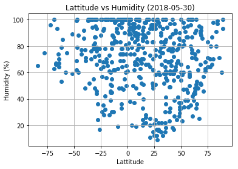
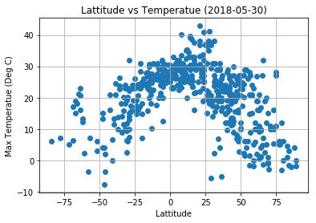
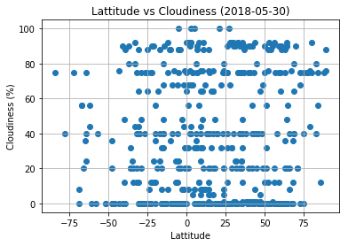
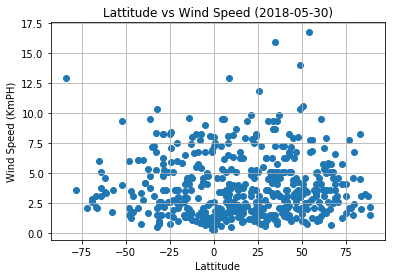

# Unit 6 | Assignment - What's the Weather Like?

## Background

Whether financial, political, or social -- data's true power lies in its ability to answer questions definitively. So let's take what you've learned about Python requests, APIs, and JSON traversals to answer a fundamental question: "What's the weather like as we approach the equator?"

Now, we know what you may be thinking: _"Duh. It gets hotter..."_ 

But, if pressed, how would you **prove** it? 


## WeatherPy

In this example, you'll be creating a Python script to visualize the weather of 500+ cities across the world of varying distance from the equator. To accomplish this, you'll be utilizing a [simple Python library](https://pypi.python.org/pypi/citipy), the [OpenWeatherMap API](https://openweathermap.org/api), and a little common sense to create a representative model of weather across world cities.

Your objective is to build a series of scatter plots to showcase the following relationships:

* Temperature (F) vs. Latitude
* Humidity (%) vs. Latitude
* Cloudiness (%) vs. Latitude
* Wind Speed (mph) vs. Latitude

Your final notebook must:

* Randomly select **at least** 500 unique (non-repeat) cities based on latitude and longitude.
* Perform a weather check on each of the cities using a series of successive API calls. 
* Include a print log of each city as it's being processed with the city number, city name, and requested URL.
* Save both a CSV of all data retrieved and png images for each scatter plot.

As final considerations:

* You must use the Matplotlib and Seaborn libraries.
* You must include a written description of three observable trends based on the data. 
* You must use proper labeling of your plots, including aspects like: Plot Titles (with date of analysis) and Axes Labels.
* You must include an exported markdown version of your Notebook called  `README.md` in your GitHub repository.  
* See [Example Solution](WeatherPy_Example.pdf) for a reference on expected format. 

## Hints and Considerations

* You may want to start this assignment by refreshing yourself on 4th grade geography, in particular, the [geographic coordinate system](http://desktop.arcgis.com/en/arcmap/10.3/guide-books/map-projections/about-geographic-coordinate-systems.htm). 

* Next, spend the requisite time necessary to study the OpenWeatherMap API. Based on your initial study, you should be able to answer  basic questions about the API: Where do you request the API key? Which Weather API in particular will you need? What URL endpoints does it expect? What JSON structure does it respond with? Before you write a line of code, you should be aiming to have a crystal clear understanding of your intended outcome.

* Though we've never worked with the [citipy Python library](https://pypi.python.org/pypi/citipy), push yourself to decipher how it works, and why it might be relevant. Before you try to incorporate the library into your analysis, start by creating simple test cases outside your main script to confirm that you are using it correctly. Too often, when introduced to a new library, students get bogged down by the most minor of errors -- spending hours investigating their entire code -- when, in fact, a simple and focused test would have shown their basic utilization of the library was wrong from the start. Don't let this be you!

* Part of our expectation in this challenge is that you will use critical thinking skills to understand how and why we're recommending the tools we are. What is Citipy for? Why would you use it in conjunction with the OpenWeatherMap API? How would you do so?

* In building your script, pay attention to the cities you are using in your query pool. Are you getting coverage of the full gamut of latitudes and longitudes? Or are you simply choosing 500 cities concentrated in one region of the world? Even if you were a geographic genius, simply rattling 500 cities based on your human selection would create a biased dataset. Be thinking of how you should counter this. (Hint: Consider the full range of latitudes).

* Lastly, remember -- this is a challenging activity. Push yourself! If you complete this task, then you can safely say that you've gained a strong mastery of the core foundations of data analytics and it will only go better from here. Good luck!

## Copyright

Coding Boot Camp (C) 2016. All Rights Reserved.


<h1> Observations </h1>
<ol>
    <li> Humidity in the cities is higher or increases as the Latitude is close to Zero degrees(Equator). </li>
    <li> Max. Temperature in the cities is higher or increases as the Latitude is close to Zero degrees(Equator). </li>
    <li> No obvious corelation between Cloudiness and Latitude. </li>
    <li> Wind Speed seems to increase as you move away from the Zero degrees Lattitude (Equator). </li>
</ol>        


```python
# Dependencies
import requests
import json
import pandas as pd
import numpy as np
from datetime import datetime
from pprint import pprint
# Google developer API key
from config import owkey
from random import *
from math import *
from citipy import citipy
import matplotlib.pyplot as plt
from mpl_toolkits.basemap import Basemap
from collections import Counter
```


```python
from itertools import chain

def draw_map(m, scale=0.2):
    # draw a shaded-relief image
    m.shadedrelief(scale=scale)
    
    # lats and longs are returned as a dictionary
    lats = m.drawparallels(np.linspace(-90, 90, 13))
    lons = m.drawmeridians(np.linspace(-180, 180, 13))

    # keys contain the plt.Line2D instances
    lat_lines = chain(*(tup[1][0] for tup in lats.items()))
    lon_lines = chain(*(tup[1][0] for tup in lons.items()))
    all_lines = chain(lat_lines, lon_lines)
    
    # cycle through these lines and set the desired style
    for line in all_lines:
        line.set(linestyle='-', alpha=0.3, color='w')
```


```python
# Define ranges for values for Lattitude and Longitude
minLat = -90
maxLat = 90
minLng = 0
maxLng = 180

cities = []
cityCountry = []
cityDict = {}
# pprint(len(cities))

# Loop until data is collected for 500 unique cities.
while len(cities) < 500:
#     print(f"\r Number of cities data collected: {len(cities)}", end=" ") 

    # Generate lattitle and longitude co-ordinates randomly
#     random_number = random()
#     lat = minLat + random() * ((maxLat - minLat))
#     lng = minLng + random() * ((maxLng - minLng))
    lat = randrange(-90,90)
    lng = randrange(-180,180)
    
    # Using the citipy library find the nearest city to the lat/lng combination.
    city = citipy.nearest_city(lat,lng)   

    # Check if the city is already in the collection, if not add else skip and try for another lat/lng.
    if city.city_name + city.country_code not in cityCountry and (len(cities) == 0 
                                                                  or Counter([city['country'] for city in cities]).most_common(1)[0][1] < 25
                                                                  or city.country_code != 'ru'):
        base_url = "https://api.openweathermap.org/data/2.5/weather?units=metric&q=%s&APPID=%s" % (city.city_name + ',' + city.country_code , owkey)
        # pprint(base_url)
        # Collect the weather data for the city and country using the open weather api.
        try:

            weather_data = requests.get(base_url).json()
            # Check if the weather data exists for that city/country, else try for another one.
            if (len(weather_data.get('base')) > 0 ):
                cityDict = {'citycountry': city.city_name + city.country_code,
                             'city' : city.city_name, 'country' : city.country_code,
                             'lat' : lat, 'lng': lng, 'cloudiness': weather_data.get('clouds').get('all'),
                             'humidity': weather_data.get('main').get('humidity'),
                             'wind speed': weather_data.get('wind').get('speed'),
                             'temp' : weather_data.get('main').get('temp_max'),
                             'base_url' : base_url}
                cities.append(cityDict)
                cityCountry.append(city.city_name + city.country_code)
                print(f"Processing record {len(cities)} of 500 | {city.city_name}, {city.country_code}")
                print(f"{base_url}")  
#                 print(f"{Counter([city['country'] for city in cities]).most_common(3)}")
                
        except:
            continue
#             pprint(city.city_name + city.country_code)
#             pprint(weather_data)
#         print(f"Running while loop: city: {city.city_name} country:{city.country_code} {Counter([city['country'] for city in cities]).most_common(5)}")
cities_df = pd.DataFrame(cities)

# cities_df.head()
```

    Processing record 1 of 500 | cabo san lucas, mx
    https://api.openweathermap.org/data/2.5/weather?units=metric&q=cabo san lucas,mx&APPID=658432372d775e19d42e7c70280b22af
    Processing record 2 of 500 | hofn, is
    https://api.openweathermap.org/data/2.5/weather?units=metric&q=hofn,is&APPID=658432372d775e19d42e7c70280b22af
    Processing record 3 of 500 | itoman, jp
    https://api.openweathermap.org/data/2.5/weather?units=metric&q=itoman,jp&APPID=658432372d775e19d42e7c70280b22af
    Processing record 4 of 500 | kapaa, us
    https://api.openweathermap.org/data/2.5/weather?units=metric&q=kapaa,us&APPID=658432372d775e19d42e7c70280b22af
    Processing record 5 of 500 | arraial do cabo, br
    https://api.openweathermap.org/data/2.5/weather?units=metric&q=arraial do cabo,br&APPID=658432372d775e19d42e7c70280b22af
    Processing record 6 of 500 | tuktoyaktuk, ca
    https://api.openweathermap.org/data/2.5/weather?units=metric&q=tuktoyaktuk,ca&APPID=658432372d775e19d42e7c70280b22af
    Processing record 7 of 500 | chuy, uy
    https://api.openweathermap.org/data/2.5/weather?units=metric&q=chuy,uy&APPID=658432372d775e19d42e7c70280b22af
    Processing record 8 of 500 | rikitea, pf
    https://api.openweathermap.org/data/2.5/weather?units=metric&q=rikitea,pf&APPID=658432372d775e19d42e7c70280b22af
    Processing record 9 of 500 | kodiak, us
    https://api.openweathermap.org/data/2.5/weather?units=metric&q=kodiak,us&APPID=658432372d775e19d42e7c70280b22af
    Processing record 10 of 500 | dikson, ru
    https://api.openweathermap.org/data/2.5/weather?units=metric&q=dikson,ru&APPID=658432372d775e19d42e7c70280b22af
    Processing record 11 of 500 | vao, nc
    https://api.openweathermap.org/data/2.5/weather?units=metric&q=vao,nc&APPID=658432372d775e19d42e7c70280b22af
    Processing record 12 of 500 | carnarvon, au
    https://api.openweathermap.org/data/2.5/weather?units=metric&q=carnarvon,au&APPID=658432372d775e19d42e7c70280b22af
    Processing record 13 of 500 | hithadhoo, mv
    https://api.openweathermap.org/data/2.5/weather?units=metric&q=hithadhoo,mv&APPID=658432372d775e19d42e7c70280b22af
    Processing record 14 of 500 | busselton, au
    https://api.openweathermap.org/data/2.5/weather?units=metric&q=busselton,au&APPID=658432372d775e19d42e7c70280b22af
    Processing record 15 of 500 | bluff, nz
    https://api.openweathermap.org/data/2.5/weather?units=metric&q=bluff,nz&APPID=658432372d775e19d42e7c70280b22af
    Processing record 16 of 500 | jumla, np
    https://api.openweathermap.org/data/2.5/weather?units=metric&q=jumla,np&APPID=658432372d775e19d42e7c70280b22af
    Processing record 17 of 500 | kavaratti, in
    https://api.openweathermap.org/data/2.5/weather?units=metric&q=kavaratti,in&APPID=658432372d775e19d42e7c70280b22af
    Processing record 18 of 500 | khatanga, ru
    https://api.openweathermap.org/data/2.5/weather?units=metric&q=khatanga,ru&APPID=658432372d775e19d42e7c70280b22af
    Processing record 19 of 500 | zhigansk, ru
    https://api.openweathermap.org/data/2.5/weather?units=metric&q=zhigansk,ru&APPID=658432372d775e19d42e7c70280b22af
    Processing record 20 of 500 | atasu, kz
    https://api.openweathermap.org/data/2.5/weather?units=metric&q=atasu,kz&APPID=658432372d775e19d42e7c70280b22af
    Processing record 21 of 500 | broome, au
    https://api.openweathermap.org/data/2.5/weather?units=metric&q=broome,au&APPID=658432372d775e19d42e7c70280b22af
    Processing record 22 of 500 | eydhafushi, mv
    https://api.openweathermap.org/data/2.5/weather?units=metric&q=eydhafushi,mv&APPID=658432372d775e19d42e7c70280b22af
    Processing record 23 of 500 | lazaro cardenas, mx
    https://api.openweathermap.org/data/2.5/weather?units=metric&q=lazaro cardenas,mx&APPID=658432372d775e19d42e7c70280b22af
    Processing record 24 of 500 | bethel, us
    https://api.openweathermap.org/data/2.5/weather?units=metric&q=bethel,us&APPID=658432372d775e19d42e7c70280b22af
    Processing record 25 of 500 | tilichiki, ru
    https://api.openweathermap.org/data/2.5/weather?units=metric&q=tilichiki,ru&APPID=658432372d775e19d42e7c70280b22af
    Processing record 26 of 500 | new norfolk, au
    https://api.openweathermap.org/data/2.5/weather?units=metric&q=new norfolk,au&APPID=658432372d775e19d42e7c70280b22af
    Processing record 27 of 500 | gizo, sb
    https://api.openweathermap.org/data/2.5/weather?units=metric&q=gizo,sb&APPID=658432372d775e19d42e7c70280b22af
    Processing record 28 of 500 | butaritari, ki
    https://api.openweathermap.org/data/2.5/weather?units=metric&q=butaritari,ki&APPID=658432372d775e19d42e7c70280b22af
    Processing record 29 of 500 | hamilton, bm
    https://api.openweathermap.org/data/2.5/weather?units=metric&q=hamilton,bm&APPID=658432372d775e19d42e7c70280b22af
    Processing record 30 of 500 | jamestown, sh
    https://api.openweathermap.org/data/2.5/weather?units=metric&q=jamestown,sh&APPID=658432372d775e19d42e7c70280b22af
    Processing record 31 of 500 | provideniya, ru
    https://api.openweathermap.org/data/2.5/weather?units=metric&q=provideniya,ru&APPID=658432372d775e19d42e7c70280b22af
    Processing record 32 of 500 | stephenville, ca
    https://api.openweathermap.org/data/2.5/weather?units=metric&q=stephenville,ca&APPID=658432372d775e19d42e7c70280b22af
    Processing record 33 of 500 | phan thiet, vn
    https://api.openweathermap.org/data/2.5/weather?units=metric&q=phan thiet,vn&APPID=658432372d775e19d42e7c70280b22af
    Processing record 34 of 500 | thompson, ca
    https://api.openweathermap.org/data/2.5/weather?units=metric&q=thompson,ca&APPID=658432372d775e19d42e7c70280b22af
    Processing record 35 of 500 | ajdabiya, ly
    https://api.openweathermap.org/data/2.5/weather?units=metric&q=ajdabiya,ly&APPID=658432372d775e19d42e7c70280b22af
    Processing record 36 of 500 | mar del plata, ar
    https://api.openweathermap.org/data/2.5/weather?units=metric&q=mar del plata,ar&APPID=658432372d775e19d42e7c70280b22af
    Processing record 37 of 500 | ribeira grande, pt
    https://api.openweathermap.org/data/2.5/weather?units=metric&q=ribeira grande,pt&APPID=658432372d775e19d42e7c70280b22af
    Processing record 38 of 500 | kazachinskoye, ru
    https://api.openweathermap.org/data/2.5/weather?units=metric&q=kazachinskoye,ru&APPID=658432372d775e19d42e7c70280b22af
    Processing record 39 of 500 | albany, au
    https://api.openweathermap.org/data/2.5/weather?units=metric&q=albany,au&APPID=658432372d775e19d42e7c70280b22af
    Processing record 40 of 500 | atuona, pf
    https://api.openweathermap.org/data/2.5/weather?units=metric&q=atuona,pf&APPID=658432372d775e19d42e7c70280b22af
    Processing record 41 of 500 | fecamp, fr
    https://api.openweathermap.org/data/2.5/weather?units=metric&q=fecamp,fr&APPID=658432372d775e19d42e7c70280b22af
    Processing record 42 of 500 | ambanja, mg
    https://api.openweathermap.org/data/2.5/weather?units=metric&q=ambanja,mg&APPID=658432372d775e19d42e7c70280b22af
    Processing record 43 of 500 | hambantota, lk
    https://api.openweathermap.org/data/2.5/weather?units=metric&q=hambantota,lk&APPID=658432372d775e19d42e7c70280b22af
    Processing record 44 of 500 | mahebourg, mu
    https://api.openweathermap.org/data/2.5/weather?units=metric&q=mahebourg,mu&APPID=658432372d775e19d42e7c70280b22af
    Processing record 45 of 500 | san jose, gt
    https://api.openweathermap.org/data/2.5/weather?units=metric&q=san jose,gt&APPID=658432372d775e19d42e7c70280b22af
    Processing record 46 of 500 | mitu, co
    https://api.openweathermap.org/data/2.5/weather?units=metric&q=mitu,co&APPID=658432372d775e19d42e7c70280b22af
    Processing record 47 of 500 | birnin kebbi, ng
    https://api.openweathermap.org/data/2.5/weather?units=metric&q=birnin kebbi,ng&APPID=658432372d775e19d42e7c70280b22af
    Processing record 48 of 500 | port elizabeth, za
    https://api.openweathermap.org/data/2.5/weather?units=metric&q=port elizabeth,za&APPID=658432372d775e19d42e7c70280b22af
    Processing record 49 of 500 | ushuaia, ar
    https://api.openweathermap.org/data/2.5/weather?units=metric&q=ushuaia,ar&APPID=658432372d775e19d42e7c70280b22af
    Processing record 50 of 500 | elko, us
    https://api.openweathermap.org/data/2.5/weather?units=metric&q=elko,us&APPID=658432372d775e19d42e7c70280b22af
    Processing record 51 of 500 | yelizovo, ru
    https://api.openweathermap.org/data/2.5/weather?units=metric&q=yelizovo,ru&APPID=658432372d775e19d42e7c70280b22af
    Processing record 52 of 500 | boone, us
    https://api.openweathermap.org/data/2.5/weather?units=metric&q=boone,us&APPID=658432372d775e19d42e7c70280b22af
    Processing record 53 of 500 | chokurdakh, ru
    https://api.openweathermap.org/data/2.5/weather?units=metric&q=chokurdakh,ru&APPID=658432372d775e19d42e7c70280b22af
    Processing record 54 of 500 | labytnangi, ru
    https://api.openweathermap.org/data/2.5/weather?units=metric&q=labytnangi,ru&APPID=658432372d775e19d42e7c70280b22af
    Processing record 55 of 500 | khonsa, in
    https://api.openweathermap.org/data/2.5/weather?units=metric&q=khonsa,in&APPID=658432372d775e19d42e7c70280b22af
    Processing record 56 of 500 | port hardy, ca
    https://api.openweathermap.org/data/2.5/weather?units=metric&q=port hardy,ca&APPID=658432372d775e19d42e7c70280b22af
    Processing record 57 of 500 | anchorage, us
    https://api.openweathermap.org/data/2.5/weather?units=metric&q=anchorage,us&APPID=658432372d775e19d42e7c70280b22af
    Processing record 58 of 500 | dolores, ar
    https://api.openweathermap.org/data/2.5/weather?units=metric&q=dolores,ar&APPID=658432372d775e19d42e7c70280b22af
    Processing record 59 of 500 | saint-joseph, re
    https://api.openweathermap.org/data/2.5/weather?units=metric&q=saint-joseph,re&APPID=658432372d775e19d42e7c70280b22af
    Processing record 60 of 500 | qaanaaq, gl
    https://api.openweathermap.org/data/2.5/weather?units=metric&q=qaanaaq,gl&APPID=658432372d775e19d42e7c70280b22af
    Processing record 61 of 500 | avarua, ck
    https://api.openweathermap.org/data/2.5/weather?units=metric&q=avarua,ck&APPID=658432372d775e19d42e7c70280b22af
    Processing record 62 of 500 | norman wells, ca
    https://api.openweathermap.org/data/2.5/weather?units=metric&q=norman wells,ca&APPID=658432372d775e19d42e7c70280b22af
    Processing record 63 of 500 | amga, ru
    https://api.openweathermap.org/data/2.5/weather?units=metric&q=amga,ru&APPID=658432372d775e19d42e7c70280b22af
    Processing record 64 of 500 | lagoa, pt
    https://api.openweathermap.org/data/2.5/weather?units=metric&q=lagoa,pt&APPID=658432372d775e19d42e7c70280b22af
    Processing record 65 of 500 | punta arenas, cl
    https://api.openweathermap.org/data/2.5/weather?units=metric&q=punta arenas,cl&APPID=658432372d775e19d42e7c70280b22af
    Processing record 66 of 500 | faanui, pf
    https://api.openweathermap.org/data/2.5/weather?units=metric&q=faanui,pf&APPID=658432372d775e19d42e7c70280b22af
    Processing record 67 of 500 | hearst, ca
    https://api.openweathermap.org/data/2.5/weather?units=metric&q=hearst,ca&APPID=658432372d775e19d42e7c70280b22af
    Processing record 68 of 500 | alofi, nu
    https://api.openweathermap.org/data/2.5/weather?units=metric&q=alofi,nu&APPID=658432372d775e19d42e7c70280b22af
    Processing record 69 of 500 | boden, se
    https://api.openweathermap.org/data/2.5/weather?units=metric&q=boden,se&APPID=658432372d775e19d42e7c70280b22af
    Processing record 70 of 500 | namibe, ao
    https://api.openweathermap.org/data/2.5/weather?units=metric&q=namibe,ao&APPID=658432372d775e19d42e7c70280b22af
    Processing record 71 of 500 | vanavara, ru
    https://api.openweathermap.org/data/2.5/weather?units=metric&q=vanavara,ru&APPID=658432372d775e19d42e7c70280b22af
    Processing record 72 of 500 | karratha, au
    https://api.openweathermap.org/data/2.5/weather?units=metric&q=karratha,au&APPID=658432372d775e19d42e7c70280b22af
    Processing record 73 of 500 | biak, id
    https://api.openweathermap.org/data/2.5/weather?units=metric&q=biak,id&APPID=658432372d775e19d42e7c70280b22af
    Processing record 74 of 500 | ljungby, se
    https://api.openweathermap.org/data/2.5/weather?units=metric&q=ljungby,se&APPID=658432372d775e19d42e7c70280b22af
    Processing record 75 of 500 | aswan, eg
    https://api.openweathermap.org/data/2.5/weather?units=metric&q=aswan,eg&APPID=658432372d775e19d42e7c70280b22af
    Processing record 76 of 500 | nobres, br
    https://api.openweathermap.org/data/2.5/weather?units=metric&q=nobres,br&APPID=658432372d775e19d42e7c70280b22af
    Processing record 77 of 500 | castro, cl
    https://api.openweathermap.org/data/2.5/weather?units=metric&q=castro,cl&APPID=658432372d775e19d42e7c70280b22af
    Processing record 78 of 500 | marquette, us
    https://api.openweathermap.org/data/2.5/weather?units=metric&q=marquette,us&APPID=658432372d775e19d42e7c70280b22af
    Processing record 79 of 500 | cape town, za
    https://api.openweathermap.org/data/2.5/weather?units=metric&q=cape town,za&APPID=658432372d775e19d42e7c70280b22af
    Processing record 80 of 500 | sao felix do xingu, br
    https://api.openweathermap.org/data/2.5/weather?units=metric&q=sao felix do xingu,br&APPID=658432372d775e19d42e7c70280b22af
    Processing record 81 of 500 | baruun-urt, mn
    https://api.openweathermap.org/data/2.5/weather?units=metric&q=baruun-urt,mn&APPID=658432372d775e19d42e7c70280b22af
    Processing record 82 of 500 | coquimbo, cl
    https://api.openweathermap.org/data/2.5/weather?units=metric&q=coquimbo,cl&APPID=658432372d775e19d42e7c70280b22af
    Processing record 83 of 500 | virginia beach, us
    https://api.openweathermap.org/data/2.5/weather?units=metric&q=virginia beach,us&APPID=658432372d775e19d42e7c70280b22af
    Processing record 84 of 500 | yumen, cn
    https://api.openweathermap.org/data/2.5/weather?units=metric&q=yumen,cn&APPID=658432372d775e19d42e7c70280b22af
    Processing record 85 of 500 | anadyr, ru
    https://api.openweathermap.org/data/2.5/weather?units=metric&q=anadyr,ru&APPID=658432372d775e19d42e7c70280b22af
    Processing record 86 of 500 | lompoc, us
    https://api.openweathermap.org/data/2.5/weather?units=metric&q=lompoc,us&APPID=658432372d775e19d42e7c70280b22af
    Processing record 87 of 500 | lorengau, pg
    https://api.openweathermap.org/data/2.5/weather?units=metric&q=lorengau,pg&APPID=658432372d775e19d42e7c70280b22af
    Processing record 88 of 500 | geraldton, au
    https://api.openweathermap.org/data/2.5/weather?units=metric&q=geraldton,au&APPID=658432372d775e19d42e7c70280b22af
    Processing record 89 of 500 | chuguyevka, ru
    https://api.openweathermap.org/data/2.5/weather?units=metric&q=chuguyevka,ru&APPID=658432372d775e19d42e7c70280b22af
    Processing record 90 of 500 | soe, id
    https://api.openweathermap.org/data/2.5/weather?units=metric&q=soe,id&APPID=658432372d775e19d42e7c70280b22af
    Processing record 91 of 500 | mbandaka, cd
    https://api.openweathermap.org/data/2.5/weather?units=metric&q=mbandaka,cd&APPID=658432372d775e19d42e7c70280b22af
    Processing record 92 of 500 | marsaxlokk, mt
    https://api.openweathermap.org/data/2.5/weather?units=metric&q=marsaxlokk,mt&APPID=658432372d775e19d42e7c70280b22af
    Processing record 93 of 500 | vrangel, ru
    https://api.openweathermap.org/data/2.5/weather?units=metric&q=vrangel,ru&APPID=658432372d775e19d42e7c70280b22af
    Processing record 94 of 500 | formosa, br
    https://api.openweathermap.org/data/2.5/weather?units=metric&q=formosa,br&APPID=658432372d775e19d42e7c70280b22af
    Processing record 95 of 500 | pacific grove, us
    https://api.openweathermap.org/data/2.5/weather?units=metric&q=pacific grove,us&APPID=658432372d775e19d42e7c70280b22af
    Processing record 96 of 500 | kamaishi, jp
    https://api.openweathermap.org/data/2.5/weather?units=metric&q=kamaishi,jp&APPID=658432372d775e19d42e7c70280b22af
    Processing record 97 of 500 | chiusi, it
    https://api.openweathermap.org/data/2.5/weather?units=metric&q=chiusi,it&APPID=658432372d775e19d42e7c70280b22af
    Processing record 98 of 500 | san cristobal, ec
    https://api.openweathermap.org/data/2.5/weather?units=metric&q=san cristobal,ec&APPID=658432372d775e19d42e7c70280b22af
    Processing record 99 of 500 | mount gambier, au
    https://api.openweathermap.org/data/2.5/weather?units=metric&q=mount gambier,au&APPID=658432372d775e19d42e7c70280b22af
    Processing record 100 of 500 | hirara, jp
    https://api.openweathermap.org/data/2.5/weather?units=metric&q=hirara,jp&APPID=658432372d775e19d42e7c70280b22af
    Processing record 101 of 500 | kutum, sd
    https://api.openweathermap.org/data/2.5/weather?units=metric&q=kutum,sd&APPID=658432372d775e19d42e7c70280b22af
    Processing record 102 of 500 | itarema, br
    https://api.openweathermap.org/data/2.5/weather?units=metric&q=itarema,br&APPID=658432372d775e19d42e7c70280b22af
    Processing record 103 of 500 | kavieng, pg
    https://api.openweathermap.org/data/2.5/weather?units=metric&q=kavieng,pg&APPID=658432372d775e19d42e7c70280b22af
    Processing record 104 of 500 | hobart, au
    https://api.openweathermap.org/data/2.5/weather?units=metric&q=hobart,au&APPID=658432372d775e19d42e7c70280b22af
    Processing record 105 of 500 | colorado springs, us
    https://api.openweathermap.org/data/2.5/weather?units=metric&q=colorado springs,us&APPID=658432372d775e19d42e7c70280b22af
    Processing record 106 of 500 | hermanus, za
    https://api.openweathermap.org/data/2.5/weather?units=metric&q=hermanus,za&APPID=658432372d775e19d42e7c70280b22af
    Processing record 107 of 500 | barrow, us
    https://api.openweathermap.org/data/2.5/weather?units=metric&q=barrow,us&APPID=658432372d775e19d42e7c70280b22af
    Processing record 108 of 500 | puerto ayora, ec
    https://api.openweathermap.org/data/2.5/weather?units=metric&q=puerto ayora,ec&APPID=658432372d775e19d42e7c70280b22af
    Processing record 109 of 500 | fuling, cn
    https://api.openweathermap.org/data/2.5/weather?units=metric&q=fuling,cn&APPID=658432372d775e19d42e7c70280b22af
    Processing record 110 of 500 | papetoai, pf
    https://api.openweathermap.org/data/2.5/weather?units=metric&q=papetoai,pf&APPID=658432372d775e19d42e7c70280b22af
    Processing record 111 of 500 | petropavlovsk-kamchatskiy, ru
    https://api.openweathermap.org/data/2.5/weather?units=metric&q=petropavlovsk-kamchatskiy,ru&APPID=658432372d775e19d42e7c70280b22af
    Processing record 112 of 500 | ilulissat, gl
    https://api.openweathermap.org/data/2.5/weather?units=metric&q=ilulissat,gl&APPID=658432372d775e19d42e7c70280b22af
    Processing record 113 of 500 | east london, za
    https://api.openweathermap.org/data/2.5/weather?units=metric&q=east london,za&APPID=658432372d775e19d42e7c70280b22af
    Processing record 114 of 500 | ancud, cl
    https://api.openweathermap.org/data/2.5/weather?units=metric&q=ancud,cl&APPID=658432372d775e19d42e7c70280b22af
    Processing record 115 of 500 | chiang khong, th
    https://api.openweathermap.org/data/2.5/weather?units=metric&q=chiang khong,th&APPID=658432372d775e19d42e7c70280b22af
    Processing record 116 of 500 | yellowknife, ca
    https://api.openweathermap.org/data/2.5/weather?units=metric&q=yellowknife,ca&APPID=658432372d775e19d42e7c70280b22af
    Processing record 117 of 500 | sur, om
    https://api.openweathermap.org/data/2.5/weather?units=metric&q=sur,om&APPID=658432372d775e19d42e7c70280b22af
    Processing record 118 of 500 | chibombo, zm
    https://api.openweathermap.org/data/2.5/weather?units=metric&q=chibombo,zm&APPID=658432372d775e19d42e7c70280b22af
    Processing record 119 of 500 | touros, br
    https://api.openweathermap.org/data/2.5/weather?units=metric&q=touros,br&APPID=658432372d775e19d42e7c70280b22af
    Processing record 120 of 500 | tucupita, ve
    https://api.openweathermap.org/data/2.5/weather?units=metric&q=tucupita,ve&APPID=658432372d775e19d42e7c70280b22af
    Processing record 121 of 500 | semnan, ir
    https://api.openweathermap.org/data/2.5/weather?units=metric&q=semnan,ir&APPID=658432372d775e19d42e7c70280b22af
    Processing record 122 of 500 | paamiut, gl
    https://api.openweathermap.org/data/2.5/weather?units=metric&q=paamiut,gl&APPID=658432372d775e19d42e7c70280b22af
    Processing record 123 of 500 | katsuura, jp
    https://api.openweathermap.org/data/2.5/weather?units=metric&q=katsuura,jp&APPID=658432372d775e19d42e7c70280b22af
    Processing record 124 of 500 | tayshet, ru
    https://api.openweathermap.org/data/2.5/weather?units=metric&q=tayshet,ru&APPID=658432372d775e19d42e7c70280b22af
    Processing record 125 of 500 | talnakh, ru
    https://api.openweathermap.org/data/2.5/weather?units=metric&q=talnakh,ru&APPID=658432372d775e19d42e7c70280b22af
    Processing record 126 of 500 | bredasdorp, za
    https://api.openweathermap.org/data/2.5/weather?units=metric&q=bredasdorp,za&APPID=658432372d775e19d42e7c70280b22af
    Processing record 127 of 500 | rehoboth, na
    https://api.openweathermap.org/data/2.5/weather?units=metric&q=rehoboth,na&APPID=658432372d775e19d42e7c70280b22af
    Processing record 128 of 500 | zvishavane, zw
    https://api.openweathermap.org/data/2.5/weather?units=metric&q=zvishavane,zw&APPID=658432372d775e19d42e7c70280b22af
    Processing record 129 of 500 | ballina, ie
    https://api.openweathermap.org/data/2.5/weather?units=metric&q=ballina,ie&APPID=658432372d775e19d42e7c70280b22af
    Processing record 130 of 500 | kurilsk, ru
    https://api.openweathermap.org/data/2.5/weather?units=metric&q=kurilsk,ru&APPID=658432372d775e19d42e7c70280b22af
    Processing record 131 of 500 | constitucion, mx
    https://api.openweathermap.org/data/2.5/weather?units=metric&q=constitucion,mx&APPID=658432372d775e19d42e7c70280b22af
    Processing record 132 of 500 | esperance, au
    https://api.openweathermap.org/data/2.5/weather?units=metric&q=esperance,au&APPID=658432372d775e19d42e7c70280b22af
    Processing record 133 of 500 | wattegama, lk
    https://api.openweathermap.org/data/2.5/weather?units=metric&q=wattegama,lk&APPID=658432372d775e19d42e7c70280b22af
    Processing record 134 of 500 | mondlo, za
    https://api.openweathermap.org/data/2.5/weather?units=metric&q=mondlo,za&APPID=658432372d775e19d42e7c70280b22af
    Processing record 135 of 500 | leshukonskoye, ru
    https://api.openweathermap.org/data/2.5/weather?units=metric&q=leshukonskoye,ru&APPID=658432372d775e19d42e7c70280b22af
    Processing record 136 of 500 | malanville, bj
    https://api.openweathermap.org/data/2.5/weather?units=metric&q=malanville,bj&APPID=658432372d775e19d42e7c70280b22af
    Processing record 137 of 500 | grand island, us
    https://api.openweathermap.org/data/2.5/weather?units=metric&q=grand island,us&APPID=658432372d775e19d42e7c70280b22af
    Processing record 138 of 500 | nome, us
    https://api.openweathermap.org/data/2.5/weather?units=metric&q=nome,us&APPID=658432372d775e19d42e7c70280b22af
    Processing record 139 of 500 | victoria, sc
    https://api.openweathermap.org/data/2.5/weather?units=metric&q=victoria,sc&APPID=658432372d775e19d42e7c70280b22af
    Processing record 140 of 500 | kisesa, tz
    https://api.openweathermap.org/data/2.5/weather?units=metric&q=kisesa,tz&APPID=658432372d775e19d42e7c70280b22af
    Processing record 141 of 500 | gasa, bt
    https://api.openweathermap.org/data/2.5/weather?units=metric&q=gasa,bt&APPID=658432372d775e19d42e7c70280b22af
    Processing record 142 of 500 | kangasala, fi
    https://api.openweathermap.org/data/2.5/weather?units=metric&q=kangasala,fi&APPID=658432372d775e19d42e7c70280b22af
    Processing record 143 of 500 | vaini, to
    https://api.openweathermap.org/data/2.5/weather?units=metric&q=vaini,to&APPID=658432372d775e19d42e7c70280b22af
    Processing record 144 of 500 | ponta do sol, cv
    https://api.openweathermap.org/data/2.5/weather?units=metric&q=ponta do sol,cv&APPID=658432372d775e19d42e7c70280b22af
    Processing record 145 of 500 | alyangula, au
    https://api.openweathermap.org/data/2.5/weather?units=metric&q=alyangula,au&APPID=658432372d775e19d42e7c70280b22af
    Processing record 146 of 500 | mingguang, cn
    https://api.openweathermap.org/data/2.5/weather?units=metric&q=mingguang,cn&APPID=658432372d775e19d42e7c70280b22af
    Processing record 147 of 500 | upernavik, gl
    https://api.openweathermap.org/data/2.5/weather?units=metric&q=upernavik,gl&APPID=658432372d775e19d42e7c70280b22af
    Processing record 148 of 500 | kuching, my
    https://api.openweathermap.org/data/2.5/weather?units=metric&q=kuching,my&APPID=658432372d775e19d42e7c70280b22af
    Processing record 149 of 500 | vila do maio, cv
    https://api.openweathermap.org/data/2.5/weather?units=metric&q=vila do maio,cv&APPID=658432372d775e19d42e7c70280b22af
    Processing record 150 of 500 | udachnyy, ru
    https://api.openweathermap.org/data/2.5/weather?units=metric&q=udachnyy,ru&APPID=658432372d775e19d42e7c70280b22af
    Processing record 151 of 500 | pevek, ru
    https://api.openweathermap.org/data/2.5/weather?units=metric&q=pevek,ru&APPID=658432372d775e19d42e7c70280b22af
    Processing record 152 of 500 | lappeenranta, fi
    https://api.openweathermap.org/data/2.5/weather?units=metric&q=lappeenranta,fi&APPID=658432372d775e19d42e7c70280b22af
    Processing record 153 of 500 | cidreira, br
    https://api.openweathermap.org/data/2.5/weather?units=metric&q=cidreira,br&APPID=658432372d775e19d42e7c70280b22af
    Processing record 154 of 500 | pak phanang, th
    https://api.openweathermap.org/data/2.5/weather?units=metric&q=pak phanang,th&APPID=658432372d775e19d42e7c70280b22af
    Processing record 155 of 500 | atambua, id
    https://api.openweathermap.org/data/2.5/weather?units=metric&q=atambua,id&APPID=658432372d775e19d42e7c70280b22af
    Processing record 156 of 500 | miri, my
    https://api.openweathermap.org/data/2.5/weather?units=metric&q=miri,my&APPID=658432372d775e19d42e7c70280b22af
    Processing record 157 of 500 | saint george, bm
    https://api.openweathermap.org/data/2.5/weather?units=metric&q=saint george,bm&APPID=658432372d775e19d42e7c70280b22af
    Processing record 158 of 500 | tucurui, br
    https://api.openweathermap.org/data/2.5/weather?units=metric&q=tucurui,br&APPID=658432372d775e19d42e7c70280b22af
    Processing record 159 of 500 | palmer, us
    https://api.openweathermap.org/data/2.5/weather?units=metric&q=palmer,us&APPID=658432372d775e19d42e7c70280b22af
    Processing record 160 of 500 | nortelandia, br
    https://api.openweathermap.org/data/2.5/weather?units=metric&q=nortelandia,br&APPID=658432372d775e19d42e7c70280b22af
    Processing record 161 of 500 | kodinsk, ru
    https://api.openweathermap.org/data/2.5/weather?units=metric&q=kodinsk,ru&APPID=658432372d775e19d42e7c70280b22af
    Processing record 162 of 500 | souillac, mu
    https://api.openweathermap.org/data/2.5/weather?units=metric&q=souillac,mu&APPID=658432372d775e19d42e7c70280b22af
    Processing record 163 of 500 | hasaki, jp
    https://api.openweathermap.org/data/2.5/weather?units=metric&q=hasaki,jp&APPID=658432372d775e19d42e7c70280b22af
    Processing record 164 of 500 | mercedes, uy
    https://api.openweathermap.org/data/2.5/weather?units=metric&q=mercedes,uy&APPID=658432372d775e19d42e7c70280b22af
    Processing record 165 of 500 | veinticinco de mayo, ar
    https://api.openweathermap.org/data/2.5/weather?units=metric&q=veinticinco de mayo,ar&APPID=658432372d775e19d42e7c70280b22af
    Processing record 166 of 500 | cherskiy, ru
    https://api.openweathermap.org/data/2.5/weather?units=metric&q=cherskiy,ru&APPID=658432372d775e19d42e7c70280b22af
    Processing record 167 of 500 | vilyuysk, ru
    https://api.openweathermap.org/data/2.5/weather?units=metric&q=vilyuysk,ru&APPID=658432372d775e19d42e7c70280b22af
    Processing record 168 of 500 | makakilo city, us
    https://api.openweathermap.org/data/2.5/weather?units=metric&q=makakilo city,us&APPID=658432372d775e19d42e7c70280b22af
    Processing record 169 of 500 | bandar, id
    https://api.openweathermap.org/data/2.5/weather?units=metric&q=bandar,id&APPID=658432372d775e19d42e7c70280b22af
    Processing record 170 of 500 | port alfred, za
    https://api.openweathermap.org/data/2.5/weather?units=metric&q=port alfred,za&APPID=658432372d775e19d42e7c70280b22af
    Processing record 171 of 500 | springdale, ca
    https://api.openweathermap.org/data/2.5/weather?units=metric&q=springdale,ca&APPID=658432372d775e19d42e7c70280b22af
    Processing record 172 of 500 | bereznik, ru
    https://api.openweathermap.org/data/2.5/weather?units=metric&q=bereznik,ru&APPID=658432372d775e19d42e7c70280b22af
    Processing record 173 of 500 | salalah, om
    https://api.openweathermap.org/data/2.5/weather?units=metric&q=salalah,om&APPID=658432372d775e19d42e7c70280b22af
    Processing record 174 of 500 | jiwani, pk
    https://api.openweathermap.org/data/2.5/weather?units=metric&q=jiwani,pk&APPID=658432372d775e19d42e7c70280b22af
    Processing record 175 of 500 | myitkyina, mm
    https://api.openweathermap.org/data/2.5/weather?units=metric&q=myitkyina,mm&APPID=658432372d775e19d42e7c70280b22af
    Processing record 176 of 500 | flin flon, ca
    https://api.openweathermap.org/data/2.5/weather?units=metric&q=flin flon,ca&APPID=658432372d775e19d42e7c70280b22af
    Processing record 177 of 500 | dingle, ie
    https://api.openweathermap.org/data/2.5/weather?units=metric&q=dingle,ie&APPID=658432372d775e19d42e7c70280b22af
    Processing record 178 of 500 | sistranda, no
    https://api.openweathermap.org/data/2.5/weather?units=metric&q=sistranda,no&APPID=658432372d775e19d42e7c70280b22af
    Processing record 179 of 500 | cordoba, ar
    https://api.openweathermap.org/data/2.5/weather?units=metric&q=cordoba,ar&APPID=658432372d775e19d42e7c70280b22af
    Processing record 180 of 500 | kangaatsiaq, gl
    https://api.openweathermap.org/data/2.5/weather?units=metric&q=kangaatsiaq,gl&APPID=658432372d775e19d42e7c70280b22af
    Processing record 181 of 500 | sechura, pe
    https://api.openweathermap.org/data/2.5/weather?units=metric&q=sechura,pe&APPID=658432372d775e19d42e7c70280b22af
    Processing record 182 of 500 | pangoa, pe
    https://api.openweathermap.org/data/2.5/weather?units=metric&q=pangoa,pe&APPID=658432372d775e19d42e7c70280b22af
    Processing record 183 of 500 | iquique, cl
    https://api.openweathermap.org/data/2.5/weather?units=metric&q=iquique,cl&APPID=658432372d775e19d42e7c70280b22af
    Processing record 184 of 500 | chambersburg, us
    https://api.openweathermap.org/data/2.5/weather?units=metric&q=chambersburg,us&APPID=658432372d775e19d42e7c70280b22af
    Processing record 185 of 500 | huancavelica, pe
    https://api.openweathermap.org/data/2.5/weather?units=metric&q=huancavelica,pe&APPID=658432372d775e19d42e7c70280b22af
    Processing record 186 of 500 | georgetown, sh
    https://api.openweathermap.org/data/2.5/weather?units=metric&q=georgetown,sh&APPID=658432372d775e19d42e7c70280b22af
    Processing record 187 of 500 | saint-philippe, re
    https://api.openweathermap.org/data/2.5/weather?units=metric&q=saint-philippe,re&APPID=658432372d775e19d42e7c70280b22af
    Processing record 188 of 500 | haines junction, ca
    https://api.openweathermap.org/data/2.5/weather?units=metric&q=haines junction,ca&APPID=658432372d775e19d42e7c70280b22af
    Processing record 189 of 500 | caravelas, br
    https://api.openweathermap.org/data/2.5/weather?units=metric&q=caravelas,br&APPID=658432372d775e19d42e7c70280b22af
    Processing record 190 of 500 | damavand, ir
    https://api.openweathermap.org/data/2.5/weather?units=metric&q=damavand,ir&APPID=658432372d775e19d42e7c70280b22af
    Processing record 191 of 500 | naruja, ge
    https://api.openweathermap.org/data/2.5/weather?units=metric&q=naruja,ge&APPID=658432372d775e19d42e7c70280b22af
    Processing record 192 of 500 | sajanan, tn
    https://api.openweathermap.org/data/2.5/weather?units=metric&q=sajanan,tn&APPID=658432372d775e19d42e7c70280b22af
    Processing record 193 of 500 | lebu, cl
    https://api.openweathermap.org/data/2.5/weather?units=metric&q=lebu,cl&APPID=658432372d775e19d42e7c70280b22af
    Processing record 194 of 500 | dandong, cn
    https://api.openweathermap.org/data/2.5/weather?units=metric&q=dandong,cn&APPID=658432372d775e19d42e7c70280b22af
    Processing record 195 of 500 | porto belo, br
    https://api.openweathermap.org/data/2.5/weather?units=metric&q=porto belo,br&APPID=658432372d775e19d42e7c70280b22af
    Processing record 196 of 500 | otjimbingwe, na
    https://api.openweathermap.org/data/2.5/weather?units=metric&q=otjimbingwe,na&APPID=658432372d775e19d42e7c70280b22af
    Processing record 197 of 500 | bekhtery, ua
    https://api.openweathermap.org/data/2.5/weather?units=metric&q=bekhtery,ua&APPID=658432372d775e19d42e7c70280b22af
    Processing record 198 of 500 | henties bay, na
    https://api.openweathermap.org/data/2.5/weather?units=metric&q=henties bay,na&APPID=658432372d775e19d42e7c70280b22af
    Processing record 199 of 500 | moree, au
    https://api.openweathermap.org/data/2.5/weather?units=metric&q=moree,au&APPID=658432372d775e19d42e7c70280b22af
    Processing record 200 of 500 | husavik, is
    https://api.openweathermap.org/data/2.5/weather?units=metric&q=husavik,is&APPID=658432372d775e19d42e7c70280b22af
    Processing record 201 of 500 | byron bay, au
    https://api.openweathermap.org/data/2.5/weather?units=metric&q=byron bay,au&APPID=658432372d775e19d42e7c70280b22af
    Processing record 202 of 500 | ormara, pk
    https://api.openweathermap.org/data/2.5/weather?units=metric&q=ormara,pk&APPID=658432372d775e19d42e7c70280b22af
    Processing record 203 of 500 | jaisalmer, in
    https://api.openweathermap.org/data/2.5/weather?units=metric&q=jaisalmer,in&APPID=658432372d775e19d42e7c70280b22af
    Processing record 204 of 500 | arlit, ne
    https://api.openweathermap.org/data/2.5/weather?units=metric&q=arlit,ne&APPID=658432372d775e19d42e7c70280b22af
    Processing record 205 of 500 | bauchi, ng
    https://api.openweathermap.org/data/2.5/weather?units=metric&q=bauchi,ng&APPID=658432372d775e19d42e7c70280b22af
    Processing record 206 of 500 | torbay, ca
    https://api.openweathermap.org/data/2.5/weather?units=metric&q=torbay,ca&APPID=658432372d775e19d42e7c70280b22af
    Processing record 207 of 500 | vila velha, br
    https://api.openweathermap.org/data/2.5/weather?units=metric&q=vila velha,br&APPID=658432372d775e19d42e7c70280b22af
    Processing record 208 of 500 | marienburg, sr
    https://api.openweathermap.org/data/2.5/weather?units=metric&q=marienburg,sr&APPID=658432372d775e19d42e7c70280b22af
    Processing record 209 of 500 | dunedin, nz
    https://api.openweathermap.org/data/2.5/weather?units=metric&q=dunedin,nz&APPID=658432372d775e19d42e7c70280b22af
    Processing record 210 of 500 | lichtenburg, za
    https://api.openweathermap.org/data/2.5/weather?units=metric&q=lichtenburg,za&APPID=658432372d775e19d42e7c70280b22af
    Processing record 211 of 500 | north myrtle beach, us
    https://api.openweathermap.org/data/2.5/weather?units=metric&q=north myrtle beach,us&APPID=658432372d775e19d42e7c70280b22af
    Processing record 212 of 500 | cabrero, cl
    https://api.openweathermap.org/data/2.5/weather?units=metric&q=cabrero,cl&APPID=658432372d775e19d42e7c70280b22af
    Processing record 213 of 500 | gouyave, gd
    https://api.openweathermap.org/data/2.5/weather?units=metric&q=gouyave,gd&APPID=658432372d775e19d42e7c70280b22af
    Processing record 214 of 500 | visnes, no
    https://api.openweathermap.org/data/2.5/weather?units=metric&q=visnes,no&APPID=658432372d775e19d42e7c70280b22af
    Processing record 215 of 500 | tasiilaq, gl
    https://api.openweathermap.org/data/2.5/weather?units=metric&q=tasiilaq,gl&APPID=658432372d775e19d42e7c70280b22af
    Processing record 216 of 500 | longyearbyen, sj
    https://api.openweathermap.org/data/2.5/weather?units=metric&q=longyearbyen,sj&APPID=658432372d775e19d42e7c70280b22af
    Processing record 217 of 500 | mabaruma, gy
    https://api.openweathermap.org/data/2.5/weather?units=metric&q=mabaruma,gy&APPID=658432372d775e19d42e7c70280b22af
    Processing record 218 of 500 | cabanbanan, ph
    https://api.openweathermap.org/data/2.5/weather?units=metric&q=cabanbanan,ph&APPID=658432372d775e19d42e7c70280b22af
    Processing record 219 of 500 | margate, za
    https://api.openweathermap.org/data/2.5/weather?units=metric&q=margate,za&APPID=658432372d775e19d42e7c70280b22af
    Processing record 220 of 500 | luderitz, na
    https://api.openweathermap.org/data/2.5/weather?units=metric&q=luderitz,na&APPID=658432372d775e19d42e7c70280b22af
    Processing record 221 of 500 | tagab, af
    https://api.openweathermap.org/data/2.5/weather?units=metric&q=tagab,af&APPID=658432372d775e19d42e7c70280b22af
    Processing record 222 of 500 | hilo, us
    https://api.openweathermap.org/data/2.5/weather?units=metric&q=hilo,us&APPID=658432372d775e19d42e7c70280b22af
    Processing record 223 of 500 | brazzaville, cg
    https://api.openweathermap.org/data/2.5/weather?units=metric&q=brazzaville,cg&APPID=658432372d775e19d42e7c70280b22af
    Processing record 224 of 500 | kahului, us
    https://api.openweathermap.org/data/2.5/weather?units=metric&q=kahului,us&APPID=658432372d775e19d42e7c70280b22af
    Processing record 225 of 500 | del rio, us
    https://api.openweathermap.org/data/2.5/weather?units=metric&q=del rio,us&APPID=658432372d775e19d42e7c70280b22af
    Processing record 226 of 500 | adrar, dz
    https://api.openweathermap.org/data/2.5/weather?units=metric&q=adrar,dz&APPID=658432372d775e19d42e7c70280b22af
    Processing record 227 of 500 | moose factory, ca
    https://api.openweathermap.org/data/2.5/weather?units=metric&q=moose factory,ca&APPID=658432372d775e19d42e7c70280b22af
    Processing record 228 of 500 | narsaq, gl
    https://api.openweathermap.org/data/2.5/weather?units=metric&q=narsaq,gl&APPID=658432372d775e19d42e7c70280b22af
    Processing record 229 of 500 | sanghar, pk
    https://api.openweathermap.org/data/2.5/weather?units=metric&q=sanghar,pk&APPID=658432372d775e19d42e7c70280b22af
    Processing record 230 of 500 | acapulco, mx
    https://api.openweathermap.org/data/2.5/weather?units=metric&q=acapulco,mx&APPID=658432372d775e19d42e7c70280b22af
    Processing record 231 of 500 | camopi, gf
    https://api.openweathermap.org/data/2.5/weather?units=metric&q=camopi,gf&APPID=658432372d775e19d42e7c70280b22af
    Processing record 232 of 500 | ternate, id
    https://api.openweathermap.org/data/2.5/weather?units=metric&q=ternate,id&APPID=658432372d775e19d42e7c70280b22af
    Processing record 233 of 500 | aklavik, ca
    https://api.openweathermap.org/data/2.5/weather?units=metric&q=aklavik,ca&APPID=658432372d775e19d42e7c70280b22af
    Processing record 234 of 500 | port augusta, au
    https://api.openweathermap.org/data/2.5/weather?units=metric&q=port augusta,au&APPID=658432372d775e19d42e7c70280b22af
    Processing record 235 of 500 | barentu, er
    https://api.openweathermap.org/data/2.5/weather?units=metric&q=barentu,er&APPID=658432372d775e19d42e7c70280b22af
    Processing record 236 of 500 | lumby, ca
    https://api.openweathermap.org/data/2.5/weather?units=metric&q=lumby,ca&APPID=658432372d775e19d42e7c70280b22af
    Processing record 237 of 500 | honningsvag, no
    https://api.openweathermap.org/data/2.5/weather?units=metric&q=honningsvag,no&APPID=658432372d775e19d42e7c70280b22af
    Processing record 238 of 500 | manokwari, id
    https://api.openweathermap.org/data/2.5/weather?units=metric&q=manokwari,id&APPID=658432372d775e19d42e7c70280b22af
    Processing record 239 of 500 | port hedland, au
    https://api.openweathermap.org/data/2.5/weather?units=metric&q=port hedland,au&APPID=658432372d775e19d42e7c70280b22af
    Processing record 240 of 500 | jinchang, cn
    https://api.openweathermap.org/data/2.5/weather?units=metric&q=jinchang,cn&APPID=658432372d775e19d42e7c70280b22af
    Processing record 241 of 500 | bambous virieux, mu
    https://api.openweathermap.org/data/2.5/weather?units=metric&q=bambous virieux,mu&APPID=658432372d775e19d42e7c70280b22af
    Processing record 242 of 500 | isangel, vu
    https://api.openweathermap.org/data/2.5/weather?units=metric&q=isangel,vu&APPID=658432372d775e19d42e7c70280b22af
    Processing record 243 of 500 | sao filipe, cv
    https://api.openweathermap.org/data/2.5/weather?units=metric&q=sao filipe,cv&APPID=658432372d775e19d42e7c70280b22af
    Processing record 244 of 500 | bathsheba, bb
    https://api.openweathermap.org/data/2.5/weather?units=metric&q=bathsheba,bb&APPID=658432372d775e19d42e7c70280b22af
    Processing record 245 of 500 | payson, us
    https://api.openweathermap.org/data/2.5/weather?units=metric&q=payson,us&APPID=658432372d775e19d42e7c70280b22af
    Processing record 246 of 500 | fukue, jp
    https://api.openweathermap.org/data/2.5/weather?units=metric&q=fukue,jp&APPID=658432372d775e19d42e7c70280b22af
    Processing record 247 of 500 | shakawe, bw
    https://api.openweathermap.org/data/2.5/weather?units=metric&q=shakawe,bw&APPID=658432372d775e19d42e7c70280b22af
    Processing record 248 of 500 | stokmarknes, no
    https://api.openweathermap.org/data/2.5/weather?units=metric&q=stokmarknes,no&APPID=658432372d775e19d42e7c70280b22af
    Processing record 249 of 500 | meulaboh, id
    https://api.openweathermap.org/data/2.5/weather?units=metric&q=meulaboh,id&APPID=658432372d775e19d42e7c70280b22af
    Processing record 250 of 500 | saint-paul, re
    https://api.openweathermap.org/data/2.5/weather?units=metric&q=saint-paul,re&APPID=658432372d775e19d42e7c70280b22af
    Processing record 251 of 500 | soyo, ao
    https://api.openweathermap.org/data/2.5/weather?units=metric&q=soyo,ao&APPID=658432372d775e19d42e7c70280b22af
    Processing record 252 of 500 | macrohon, ph
    https://api.openweathermap.org/data/2.5/weather?units=metric&q=macrohon,ph&APPID=658432372d775e19d42e7c70280b22af
    Processing record 253 of 500 | bandarbeyla, so
    https://api.openweathermap.org/data/2.5/weather?units=metric&q=bandarbeyla,so&APPID=658432372d775e19d42e7c70280b22af
    Processing record 254 of 500 | banda aceh, id
    https://api.openweathermap.org/data/2.5/weather?units=metric&q=banda aceh,id&APPID=658432372d775e19d42e7c70280b22af
    Processing record 255 of 500 | iracoubo, gf
    https://api.openweathermap.org/data/2.5/weather?units=metric&q=iracoubo,gf&APPID=658432372d775e19d42e7c70280b22af
    Processing record 256 of 500 | panaba, mx
    https://api.openweathermap.org/data/2.5/weather?units=metric&q=panaba,mx&APPID=658432372d775e19d42e7c70280b22af
    Processing record 257 of 500 | rocha, uy
    https://api.openweathermap.org/data/2.5/weather?units=metric&q=rocha,uy&APPID=658432372d775e19d42e7c70280b22af
    Processing record 258 of 500 | kushima, jp
    https://api.openweathermap.org/data/2.5/weather?units=metric&q=kushima,jp&APPID=658432372d775e19d42e7c70280b22af
    Processing record 259 of 500 | gondanglegi, id
    https://api.openweathermap.org/data/2.5/weather?units=metric&q=gondanglegi,id&APPID=658432372d775e19d42e7c70280b22af
    Processing record 260 of 500 | charters towers, au
    https://api.openweathermap.org/data/2.5/weather?units=metric&q=charters towers,au&APPID=658432372d775e19d42e7c70280b22af
    Processing record 261 of 500 | misratah, ly
    https://api.openweathermap.org/data/2.5/weather?units=metric&q=misratah,ly&APPID=658432372d775e19d42e7c70280b22af
    Processing record 262 of 500 | larsnes, no
    https://api.openweathermap.org/data/2.5/weather?units=metric&q=larsnes,no&APPID=658432372d775e19d42e7c70280b22af
    Processing record 263 of 500 | shimoda, jp
    https://api.openweathermap.org/data/2.5/weather?units=metric&q=shimoda,jp&APPID=658432372d775e19d42e7c70280b22af
    Processing record 264 of 500 | male, mv
    https://api.openweathermap.org/data/2.5/weather?units=metric&q=male,mv&APPID=658432372d775e19d42e7c70280b22af
    Processing record 265 of 500 | gamba, ga
    https://api.openweathermap.org/data/2.5/weather?units=metric&q=gamba,ga&APPID=658432372d775e19d42e7c70280b22af
    Processing record 266 of 500 | thinadhoo, mv
    https://api.openweathermap.org/data/2.5/weather?units=metric&q=thinadhoo,mv&APPID=658432372d775e19d42e7c70280b22af
    Processing record 267 of 500 | cabanas, cu
    https://api.openweathermap.org/data/2.5/weather?units=metric&q=cabanas,cu&APPID=658432372d775e19d42e7c70280b22af
    Processing record 268 of 500 | port blair, in
    https://api.openweathermap.org/data/2.5/weather?units=metric&q=port blair,in&APPID=658432372d775e19d42e7c70280b22af
    Processing record 269 of 500 | awjilah, ly
    https://api.openweathermap.org/data/2.5/weather?units=metric&q=awjilah,ly&APPID=658432372d775e19d42e7c70280b22af
    Processing record 270 of 500 | nouadhibou, mr
    https://api.openweathermap.org/data/2.5/weather?units=metric&q=nouadhibou,mr&APPID=658432372d775e19d42e7c70280b22af
    Processing record 271 of 500 | vardo, no
    https://api.openweathermap.org/data/2.5/weather?units=metric&q=vardo,no&APPID=658432372d775e19d42e7c70280b22af
    Processing record 272 of 500 | antalaha, mg
    https://api.openweathermap.org/data/2.5/weather?units=metric&q=antalaha,mg&APPID=658432372d775e19d42e7c70280b22af
    Processing record 273 of 500 | sabancuy, mx
    https://api.openweathermap.org/data/2.5/weather?units=metric&q=sabancuy,mx&APPID=658432372d775e19d42e7c70280b22af
    Processing record 274 of 500 | rio gallegos, ar
    https://api.openweathermap.org/data/2.5/weather?units=metric&q=rio gallegos,ar&APPID=658432372d775e19d42e7c70280b22af
    Processing record 275 of 500 | talcahuano, cl
    https://api.openweathermap.org/data/2.5/weather?units=metric&q=talcahuano,cl&APPID=658432372d775e19d42e7c70280b22af
    Processing record 276 of 500 | kaitangata, nz
    https://api.openweathermap.org/data/2.5/weather?units=metric&q=kaitangata,nz&APPID=658432372d775e19d42e7c70280b22af
    Processing record 277 of 500 | ranong, th
    https://api.openweathermap.org/data/2.5/weather?units=metric&q=ranong,th&APPID=658432372d775e19d42e7c70280b22af
    Processing record 278 of 500 | marawi, sd
    https://api.openweathermap.org/data/2.5/weather?units=metric&q=marawi,sd&APPID=658432372d775e19d42e7c70280b22af
    Processing record 279 of 500 | sorong, id
    https://api.openweathermap.org/data/2.5/weather?units=metric&q=sorong,id&APPID=658432372d775e19d42e7c70280b22af
    Processing record 280 of 500 | newport, us
    https://api.openweathermap.org/data/2.5/weather?units=metric&q=newport,us&APPID=658432372d775e19d42e7c70280b22af
    Processing record 281 of 500 | bonavista, ca
    https://api.openweathermap.org/data/2.5/weather?units=metric&q=bonavista,ca&APPID=658432372d775e19d42e7c70280b22af
    Processing record 282 of 500 | bol, td
    https://api.openweathermap.org/data/2.5/weather?units=metric&q=bol,td&APPID=658432372d775e19d42e7c70280b22af
    Processing record 283 of 500 | dondo, mz
    https://api.openweathermap.org/data/2.5/weather?units=metric&q=dondo,mz&APPID=658432372d775e19d42e7c70280b22af
    Processing record 284 of 500 | jasper, ca
    https://api.openweathermap.org/data/2.5/weather?units=metric&q=jasper,ca&APPID=658432372d775e19d42e7c70280b22af
    Processing record 285 of 500 | saldanha, za
    https://api.openweathermap.org/data/2.5/weather?units=metric&q=saldanha,za&APPID=658432372d775e19d42e7c70280b22af
    Processing record 286 of 500 | nynashamn, se
    https://api.openweathermap.org/data/2.5/weather?units=metric&q=nynashamn,se&APPID=658432372d775e19d42e7c70280b22af
    Processing record 287 of 500 | birjand, ir
    https://api.openweathermap.org/data/2.5/weather?units=metric&q=birjand,ir&APPID=658432372d775e19d42e7c70280b22af
    Processing record 288 of 500 | omboue, ga
    https://api.openweathermap.org/data/2.5/weather?units=metric&q=omboue,ga&APPID=658432372d775e19d42e7c70280b22af
    Processing record 289 of 500 | stellenbosch, za
    https://api.openweathermap.org/data/2.5/weather?units=metric&q=stellenbosch,za&APPID=658432372d775e19d42e7c70280b22af
    Processing record 290 of 500 | aksay, kz
    https://api.openweathermap.org/data/2.5/weather?units=metric&q=aksay,kz&APPID=658432372d775e19d42e7c70280b22af
    Processing record 291 of 500 | kalmunai, lk
    https://api.openweathermap.org/data/2.5/weather?units=metric&q=kalmunai,lk&APPID=658432372d775e19d42e7c70280b22af
    Processing record 292 of 500 | san patricio, mx
    https://api.openweathermap.org/data/2.5/weather?units=metric&q=san patricio,mx&APPID=658432372d775e19d42e7c70280b22af
    Processing record 293 of 500 | fare, pf
    https://api.openweathermap.org/data/2.5/weather?units=metric&q=fare,pf&APPID=658432372d775e19d42e7c70280b22af
    Processing record 294 of 500 | korcula, hr
    https://api.openweathermap.org/data/2.5/weather?units=metric&q=korcula,hr&APPID=658432372d775e19d42e7c70280b22af
    Processing record 295 of 500 | gairo, tz
    https://api.openweathermap.org/data/2.5/weather?units=metric&q=gairo,tz&APPID=658432372d775e19d42e7c70280b22af
    Processing record 296 of 500 | nizwa, om
    https://api.openweathermap.org/data/2.5/weather?units=metric&q=nizwa,om&APPID=658432372d775e19d42e7c70280b22af
    Processing record 297 of 500 | manta, ec
    https://api.openweathermap.org/data/2.5/weather?units=metric&q=manta,ec&APPID=658432372d775e19d42e7c70280b22af
    Processing record 298 of 500 | itaituba, br
    https://api.openweathermap.org/data/2.5/weather?units=metric&q=itaituba,br&APPID=658432372d775e19d42e7c70280b22af
    Processing record 299 of 500 | gorontalo, id
    https://api.openweathermap.org/data/2.5/weather?units=metric&q=gorontalo,id&APPID=658432372d775e19d42e7c70280b22af
    Processing record 300 of 500 | tuatapere, nz
    https://api.openweathermap.org/data/2.5/weather?units=metric&q=tuatapere,nz&APPID=658432372d775e19d42e7c70280b22af
    Processing record 301 of 500 | aguimes, es
    https://api.openweathermap.org/data/2.5/weather?units=metric&q=aguimes,es&APPID=658432372d775e19d42e7c70280b22af
    Processing record 302 of 500 | chicama, pe
    https://api.openweathermap.org/data/2.5/weather?units=metric&q=chicama,pe&APPID=658432372d775e19d42e7c70280b22af
    Processing record 303 of 500 | college, us
    https://api.openweathermap.org/data/2.5/weather?units=metric&q=college,us&APPID=658432372d775e19d42e7c70280b22af
    Processing record 304 of 500 | richards bay, za
    https://api.openweathermap.org/data/2.5/weather?units=metric&q=richards bay,za&APPID=658432372d775e19d42e7c70280b22af
    Processing record 305 of 500 | inhambane, mz
    https://api.openweathermap.org/data/2.5/weather?units=metric&q=inhambane,mz&APPID=658432372d775e19d42e7c70280b22af
    Processing record 306 of 500 | simoes, br
    https://api.openweathermap.org/data/2.5/weather?units=metric&q=simoes,br&APPID=658432372d775e19d42e7c70280b22af
    Processing record 307 of 500 | berga, es
    https://api.openweathermap.org/data/2.5/weather?units=metric&q=berga,es&APPID=658432372d775e19d42e7c70280b22af
    Processing record 308 of 500 | pokhara, np
    https://api.openweathermap.org/data/2.5/weather?units=metric&q=pokhara,np&APPID=658432372d775e19d42e7c70280b22af
    Processing record 309 of 500 | quang ngai, vn
    https://api.openweathermap.org/data/2.5/weather?units=metric&q=quang ngai,vn&APPID=658432372d775e19d42e7c70280b22af
    Processing record 310 of 500 | darab, ir
    https://api.openweathermap.org/data/2.5/weather?units=metric&q=darab,ir&APPID=658432372d775e19d42e7c70280b22af
    Processing record 311 of 500 | hastings, us
    https://api.openweathermap.org/data/2.5/weather?units=metric&q=hastings,us&APPID=658432372d775e19d42e7c70280b22af
    Processing record 312 of 500 | vanimo, pg
    https://api.openweathermap.org/data/2.5/weather?units=metric&q=vanimo,pg&APPID=658432372d775e19d42e7c70280b22af
    Processing record 313 of 500 | nagapattinam, in
    https://api.openweathermap.org/data/2.5/weather?units=metric&q=nagapattinam,in&APPID=658432372d775e19d42e7c70280b22af
    Processing record 314 of 500 | gryfice, pl
    https://api.openweathermap.org/data/2.5/weather?units=metric&q=gryfice,pl&APPID=658432372d775e19d42e7c70280b22af
    Processing record 315 of 500 | inongo, cd
    https://api.openweathermap.org/data/2.5/weather?units=metric&q=inongo,cd&APPID=658432372d775e19d42e7c70280b22af
    Processing record 316 of 500 | nakhon thai, th
    https://api.openweathermap.org/data/2.5/weather?units=metric&q=nakhon thai,th&APPID=658432372d775e19d42e7c70280b22af
    Processing record 317 of 500 | buncrana, ie
    https://api.openweathermap.org/data/2.5/weather?units=metric&q=buncrana,ie&APPID=658432372d775e19d42e7c70280b22af
    Processing record 318 of 500 | ajaccio, fr
    https://api.openweathermap.org/data/2.5/weather?units=metric&q=ajaccio,fr&APPID=658432372d775e19d42e7c70280b22af
    Processing record 319 of 500 | nong phai, th
    https://api.openweathermap.org/data/2.5/weather?units=metric&q=nong phai,th&APPID=658432372d775e19d42e7c70280b22af
    Processing record 320 of 500 | ponta delgada, pt
    https://api.openweathermap.org/data/2.5/weather?units=metric&q=ponta delgada,pt&APPID=658432372d775e19d42e7c70280b22af
    Processing record 321 of 500 | cayenne, gf
    https://api.openweathermap.org/data/2.5/weather?units=metric&q=cayenne,gf&APPID=658432372d775e19d42e7c70280b22af
    Processing record 322 of 500 | barvinkove, ua
    https://api.openweathermap.org/data/2.5/weather?units=metric&q=barvinkove,ua&APPID=658432372d775e19d42e7c70280b22af
    Processing record 323 of 500 | barabai, id
    https://api.openweathermap.org/data/2.5/weather?units=metric&q=barabai,id&APPID=658432372d775e19d42e7c70280b22af
    Processing record 324 of 500 | wajir, ke
    https://api.openweathermap.org/data/2.5/weather?units=metric&q=wajir,ke&APPID=658432372d775e19d42e7c70280b22af
    Processing record 325 of 500 | la ronge, ca
    https://api.openweathermap.org/data/2.5/weather?units=metric&q=la ronge,ca&APPID=658432372d775e19d42e7c70280b22af
    Processing record 326 of 500 | naberera, tz
    https://api.openweathermap.org/data/2.5/weather?units=metric&q=naberera,tz&APPID=658432372d775e19d42e7c70280b22af
    Processing record 327 of 500 | rock springs, us
    https://api.openweathermap.org/data/2.5/weather?units=metric&q=rock springs,us&APPID=658432372d775e19d42e7c70280b22af
    Processing record 328 of 500 | san juan, ar
    https://api.openweathermap.org/data/2.5/weather?units=metric&q=san juan,ar&APPID=658432372d775e19d42e7c70280b22af
    Processing record 329 of 500 | ozark, us
    https://api.openweathermap.org/data/2.5/weather?units=metric&q=ozark,us&APPID=658432372d775e19d42e7c70280b22af
    Processing record 330 of 500 | shizuishan, cn
    https://api.openweathermap.org/data/2.5/weather?units=metric&q=shizuishan,cn&APPID=658432372d775e19d42e7c70280b22af
    Processing record 331 of 500 | kruisfontein, za
    https://api.openweathermap.org/data/2.5/weather?units=metric&q=kruisfontein,za&APPID=658432372d775e19d42e7c70280b22af
    Processing record 332 of 500 | buraydah, sa
    https://api.openweathermap.org/data/2.5/weather?units=metric&q=buraydah,sa&APPID=658432372d775e19d42e7c70280b22af
    Processing record 333 of 500 | goundi, td
    https://api.openweathermap.org/data/2.5/weather?units=metric&q=goundi,td&APPID=658432372d775e19d42e7c70280b22af
    Processing record 334 of 500 | lodja, cd
    https://api.openweathermap.org/data/2.5/weather?units=metric&q=lodja,cd&APPID=658432372d775e19d42e7c70280b22af
    Processing record 335 of 500 | jati, id
    https://api.openweathermap.org/data/2.5/weather?units=metric&q=jati,id&APPID=658432372d775e19d42e7c70280b22af
    Processing record 336 of 500 | casablanca, ma
    https://api.openweathermap.org/data/2.5/weather?units=metric&q=casablanca,ma&APPID=658432372d775e19d42e7c70280b22af
    Processing record 337 of 500 | alice springs, au
    https://api.openweathermap.org/data/2.5/weather?units=metric&q=alice springs,au&APPID=658432372d775e19d42e7c70280b22af
    Processing record 338 of 500 | mokobeng, bw
    https://api.openweathermap.org/data/2.5/weather?units=metric&q=mokobeng,bw&APPID=658432372d775e19d42e7c70280b22af
    Processing record 339 of 500 | fortuna, us
    https://api.openweathermap.org/data/2.5/weather?units=metric&q=fortuna,us&APPID=658432372d775e19d42e7c70280b22af
    Processing record 340 of 500 | russell, nz
    https://api.openweathermap.org/data/2.5/weather?units=metric&q=russell,nz&APPID=658432372d775e19d42e7c70280b22af
    Processing record 341 of 500 | sao jose da coroa grande, br
    https://api.openweathermap.org/data/2.5/weather?units=metric&q=sao jose da coroa grande,br&APPID=658432372d775e19d42e7c70280b22af
    Processing record 342 of 500 | kindu, cd
    https://api.openweathermap.org/data/2.5/weather?units=metric&q=kindu,cd&APPID=658432372d775e19d42e7c70280b22af
    Processing record 343 of 500 | miles city, us
    https://api.openweathermap.org/data/2.5/weather?units=metric&q=miles city,us&APPID=658432372d775e19d42e7c70280b22af
    Processing record 344 of 500 | milton, nz
    https://api.openweathermap.org/data/2.5/weather?units=metric&q=milton,nz&APPID=658432372d775e19d42e7c70280b22af
    Processing record 345 of 500 | quelimane, mz
    https://api.openweathermap.org/data/2.5/weather?units=metric&q=quelimane,mz&APPID=658432372d775e19d42e7c70280b22af
    Processing record 346 of 500 | the valley, ai
    https://api.openweathermap.org/data/2.5/weather?units=metric&q=the valley,ai&APPID=658432372d775e19d42e7c70280b22af
    Processing record 347 of 500 | vicente guerrero, mx
    https://api.openweathermap.org/data/2.5/weather?units=metric&q=vicente guerrero,mx&APPID=658432372d775e19d42e7c70280b22af
    Processing record 348 of 500 | inirida, co
    https://api.openweathermap.org/data/2.5/weather?units=metric&q=inirida,co&APPID=658432372d775e19d42e7c70280b22af
    Processing record 349 of 500 | eureka, us
    https://api.openweathermap.org/data/2.5/weather?units=metric&q=eureka,us&APPID=658432372d775e19d42e7c70280b22af
    Processing record 350 of 500 | bongandanga, cd
    https://api.openweathermap.org/data/2.5/weather?units=metric&q=bongandanga,cd&APPID=658432372d775e19d42e7c70280b22af
    Processing record 351 of 500 | hvide sande, dk
    https://api.openweathermap.org/data/2.5/weather?units=metric&q=hvide sande,dk&APPID=658432372d775e19d42e7c70280b22af
    Processing record 352 of 500 | klaksvik, fo
    https://api.openweathermap.org/data/2.5/weather?units=metric&q=klaksvik,fo&APPID=658432372d775e19d42e7c70280b22af
    Processing record 353 of 500 | samarai, pg
    https://api.openweathermap.org/data/2.5/weather?units=metric&q=samarai,pg&APPID=658432372d775e19d42e7c70280b22af
    Processing record 354 of 500 | shu, kz
    https://api.openweathermap.org/data/2.5/weather?units=metric&q=shu,kz&APPID=658432372d775e19d42e7c70280b22af
    Processing record 355 of 500 | kiunga, pg
    https://api.openweathermap.org/data/2.5/weather?units=metric&q=kiunga,pg&APPID=658432372d775e19d42e7c70280b22af
    Processing record 356 of 500 | coihaique, cl
    https://api.openweathermap.org/data/2.5/weather?units=metric&q=coihaique,cl&APPID=658432372d775e19d42e7c70280b22af
    Processing record 357 of 500 | clyde river, ca
    https://api.openweathermap.org/data/2.5/weather?units=metric&q=clyde river,ca&APPID=658432372d775e19d42e7c70280b22af
    Processing record 358 of 500 | guerrero negro, mx
    https://api.openweathermap.org/data/2.5/weather?units=metric&q=guerrero negro,mx&APPID=658432372d775e19d42e7c70280b22af
    Processing record 359 of 500 | porgera, pg
    https://api.openweathermap.org/data/2.5/weather?units=metric&q=porgera,pg&APPID=658432372d775e19d42e7c70280b22af
    Processing record 360 of 500 | quatre cocos, mu
    https://api.openweathermap.org/data/2.5/weather?units=metric&q=quatre cocos,mu&APPID=658432372d775e19d42e7c70280b22af
    Processing record 361 of 500 | kasongo-lunda, cd
    https://api.openweathermap.org/data/2.5/weather?units=metric&q=kasongo-lunda,cd&APPID=658432372d775e19d42e7c70280b22af
    Processing record 362 of 500 | los llanos de aridane, es
    https://api.openweathermap.org/data/2.5/weather?units=metric&q=los llanos de aridane,es&APPID=658432372d775e19d42e7c70280b22af
    Processing record 363 of 500 | koson, uz
    https://api.openweathermap.org/data/2.5/weather?units=metric&q=koson,uz&APPID=658432372d775e19d42e7c70280b22af
    Processing record 364 of 500 | cobija, bo
    https://api.openweathermap.org/data/2.5/weather?units=metric&q=cobija,bo&APPID=658432372d775e19d42e7c70280b22af
    Processing record 365 of 500 | coos bay, us
    https://api.openweathermap.org/data/2.5/weather?units=metric&q=coos bay,us&APPID=658432372d775e19d42e7c70280b22af
    Processing record 366 of 500 | fuerte olimpo, py
    https://api.openweathermap.org/data/2.5/weather?units=metric&q=fuerte olimpo,py&APPID=658432372d775e19d42e7c70280b22af
    Processing record 367 of 500 | camacha, pt
    https://api.openweathermap.org/data/2.5/weather?units=metric&q=camacha,pt&APPID=658432372d775e19d42e7c70280b22af
    Processing record 368 of 500 | coruripe, br
    https://api.openweathermap.org/data/2.5/weather?units=metric&q=coruripe,br&APPID=658432372d775e19d42e7c70280b22af
    Processing record 369 of 500 | vestmanna, fo
    https://api.openweathermap.org/data/2.5/weather?units=metric&q=vestmanna,fo&APPID=658432372d775e19d42e7c70280b22af
    Processing record 370 of 500 | houma, us
    https://api.openweathermap.org/data/2.5/weather?units=metric&q=houma,us&APPID=658432372d775e19d42e7c70280b22af
    Processing record 371 of 500 | mandalgovi, mn
    https://api.openweathermap.org/data/2.5/weather?units=metric&q=mandalgovi,mn&APPID=658432372d775e19d42e7c70280b22af
    Processing record 372 of 500 | paciran, id
    https://api.openweathermap.org/data/2.5/weather?units=metric&q=paciran,id&APPID=658432372d775e19d42e7c70280b22af
    Processing record 373 of 500 | san borja, bo
    https://api.openweathermap.org/data/2.5/weather?units=metric&q=san borja,bo&APPID=658432372d775e19d42e7c70280b22af
    Processing record 374 of 500 | hervey bay, au
    https://api.openweathermap.org/data/2.5/weather?units=metric&q=hervey bay,au&APPID=658432372d775e19d42e7c70280b22af
    Processing record 375 of 500 | casper, us
    https://api.openweathermap.org/data/2.5/weather?units=metric&q=casper,us&APPID=658432372d775e19d42e7c70280b22af
    Processing record 376 of 500 | rosarito, mx
    https://api.openweathermap.org/data/2.5/weather?units=metric&q=rosarito,mx&APPID=658432372d775e19d42e7c70280b22af
    Processing record 377 of 500 | najran, sa
    https://api.openweathermap.org/data/2.5/weather?units=metric&q=najran,sa&APPID=658432372d775e19d42e7c70280b22af
    Processing record 378 of 500 | baneh, ir
    https://api.openweathermap.org/data/2.5/weather?units=metric&q=baneh,ir&APPID=658432372d775e19d42e7c70280b22af
    Processing record 379 of 500 | akdepe, tm
    https://api.openweathermap.org/data/2.5/weather?units=metric&q=akdepe,tm&APPID=658432372d775e19d42e7c70280b22af
    Processing record 380 of 500 | qom, ir
    https://api.openweathermap.org/data/2.5/weather?units=metric&q=qom,ir&APPID=658432372d775e19d42e7c70280b22af
    Processing record 381 of 500 | velyka lepetykha, ua
    https://api.openweathermap.org/data/2.5/weather?units=metric&q=velyka lepetykha,ua&APPID=658432372d775e19d42e7c70280b22af
    Processing record 382 of 500 | emerald, au
    https://api.openweathermap.org/data/2.5/weather?units=metric&q=emerald,au&APPID=658432372d775e19d42e7c70280b22af
    Processing record 383 of 500 | buritizeiro, br
    https://api.openweathermap.org/data/2.5/weather?units=metric&q=buritizeiro,br&APPID=658432372d775e19d42e7c70280b22af
    Processing record 384 of 500 | ginir, et
    https://api.openweathermap.org/data/2.5/weather?units=metric&q=ginir,et&APPID=658432372d775e19d42e7c70280b22af
    Processing record 385 of 500 | clarence town, bs
    https://api.openweathermap.org/data/2.5/weather?units=metric&q=clarence town,bs&APPID=658432372d775e19d42e7c70280b22af
    Processing record 386 of 500 | xuddur, so
    https://api.openweathermap.org/data/2.5/weather?units=metric&q=xuddur,so&APPID=658432372d775e19d42e7c70280b22af
    Processing record 387 of 500 | sorland, no
    https://api.openweathermap.org/data/2.5/weather?units=metric&q=sorland,no&APPID=658432372d775e19d42e7c70280b22af
    Processing record 388 of 500 | flinders, au
    https://api.openweathermap.org/data/2.5/weather?units=metric&q=flinders,au&APPID=658432372d775e19d42e7c70280b22af
    Processing record 389 of 500 | hovd, mn
    https://api.openweathermap.org/data/2.5/weather?units=metric&q=hovd,mn&APPID=658432372d775e19d42e7c70280b22af
    Processing record 390 of 500 | la romana, do
    https://api.openweathermap.org/data/2.5/weather?units=metric&q=la romana,do&APPID=658432372d775e19d42e7c70280b22af
    Processing record 391 of 500 | ugoofaaru, mv
    https://api.openweathermap.org/data/2.5/weather?units=metric&q=ugoofaaru,mv&APPID=658432372d775e19d42e7c70280b22af
    Processing record 392 of 500 | damaturu, ng
    https://api.openweathermap.org/data/2.5/weather?units=metric&q=damaturu,ng&APPID=658432372d775e19d42e7c70280b22af
    Processing record 393 of 500 | nemyriv, ua
    https://api.openweathermap.org/data/2.5/weather?units=metric&q=nemyriv,ua&APPID=658432372d775e19d42e7c70280b22af
    Processing record 394 of 500 | ahipara, nz
    https://api.openweathermap.org/data/2.5/weather?units=metric&q=ahipara,nz&APPID=658432372d775e19d42e7c70280b22af
    Processing record 395 of 500 | arinos, br
    https://api.openweathermap.org/data/2.5/weather?units=metric&q=arinos,br&APPID=658432372d775e19d42e7c70280b22af
    Processing record 396 of 500 | popondetta, pg
    https://api.openweathermap.org/data/2.5/weather?units=metric&q=popondetta,pg&APPID=658432372d775e19d42e7c70280b22af
    Processing record 397 of 500 | pangnirtung, ca
    https://api.openweathermap.org/data/2.5/weather?units=metric&q=pangnirtung,ca&APPID=658432372d775e19d42e7c70280b22af
    Processing record 398 of 500 | helong, cn
    https://api.openweathermap.org/data/2.5/weather?units=metric&q=helong,cn&APPID=658432372d775e19d42e7c70280b22af
    Processing record 399 of 500 | el terrero, hn
    https://api.openweathermap.org/data/2.5/weather?units=metric&q=el terrero,hn&APPID=658432372d775e19d42e7c70280b22af
    Processing record 400 of 500 | nelson bay, au
    https://api.openweathermap.org/data/2.5/weather?units=metric&q=nelson bay,au&APPID=658432372d775e19d42e7c70280b22af
    Processing record 401 of 500 | mana, gf
    https://api.openweathermap.org/data/2.5/weather?units=metric&q=mana,gf&APPID=658432372d775e19d42e7c70280b22af
    Processing record 402 of 500 | maine-soroa, ne
    https://api.openweathermap.org/data/2.5/weather?units=metric&q=maine-soroa,ne&APPID=658432372d775e19d42e7c70280b22af
    Processing record 403 of 500 | maniitsoq, gl
    https://api.openweathermap.org/data/2.5/weather?units=metric&q=maniitsoq,gl&APPID=658432372d775e19d42e7c70280b22af
    Processing record 404 of 500 | tuban, id
    https://api.openweathermap.org/data/2.5/weather?units=metric&q=tuban,id&APPID=658432372d775e19d42e7c70280b22af
    Processing record 405 of 500 | madang, pg
    https://api.openweathermap.org/data/2.5/weather?units=metric&q=madang,pg&APPID=658432372d775e19d42e7c70280b22af
    Processing record 406 of 500 | calabozo, ve
    https://api.openweathermap.org/data/2.5/weather?units=metric&q=calabozo,ve&APPID=658432372d775e19d42e7c70280b22af
    Processing record 407 of 500 | sitka, us
    https://api.openweathermap.org/data/2.5/weather?units=metric&q=sitka,us&APPID=658432372d775e19d42e7c70280b22af
    Processing record 408 of 500 | paita, pe
    https://api.openweathermap.org/data/2.5/weather?units=metric&q=paita,pe&APPID=658432372d775e19d42e7c70280b22af
    Processing record 409 of 500 | necochea, ar
    https://api.openweathermap.org/data/2.5/weather?units=metric&q=necochea,ar&APPID=658432372d775e19d42e7c70280b22af
    Processing record 410 of 500 | pirenopolis, br
    https://api.openweathermap.org/data/2.5/weather?units=metric&q=pirenopolis,br&APPID=658432372d775e19d42e7c70280b22af
    Processing record 411 of 500 | tete, mz
    https://api.openweathermap.org/data/2.5/weather?units=metric&q=tete,mz&APPID=658432372d775e19d42e7c70280b22af
    Processing record 412 of 500 | singaraja, id
    https://api.openweathermap.org/data/2.5/weather?units=metric&q=singaraja,id&APPID=658432372d775e19d42e7c70280b22af
    Processing record 413 of 500 | si sa ket, th
    https://api.openweathermap.org/data/2.5/weather?units=metric&q=si sa ket,th&APPID=658432372d775e19d42e7c70280b22af
    Processing record 414 of 500 | leh, in
    https://api.openweathermap.org/data/2.5/weather?units=metric&q=leh,in&APPID=658432372d775e19d42e7c70280b22af
    Processing record 415 of 500 | yanam, in
    https://api.openweathermap.org/data/2.5/weather?units=metric&q=yanam,in&APPID=658432372d775e19d42e7c70280b22af
    Processing record 416 of 500 | bardiyah, ly
    https://api.openweathermap.org/data/2.5/weather?units=metric&q=bardiyah,ly&APPID=658432372d775e19d42e7c70280b22af
    Processing record 417 of 500 | kanchanaburi, th
    https://api.openweathermap.org/data/2.5/weather?units=metric&q=kanchanaburi,th&APPID=658432372d775e19d42e7c70280b22af
    Processing record 418 of 500 | odienne, ci
    https://api.openweathermap.org/data/2.5/weather?units=metric&q=odienne,ci&APPID=658432372d775e19d42e7c70280b22af
    Processing record 419 of 500 | roald, no
    https://api.openweathermap.org/data/2.5/weather?units=metric&q=roald,no&APPID=658432372d775e19d42e7c70280b22af
    Processing record 420 of 500 | arcata, us
    https://api.openweathermap.org/data/2.5/weather?units=metric&q=arcata,us&APPID=658432372d775e19d42e7c70280b22af
    Processing record 421 of 500 | daru, pg
    https://api.openweathermap.org/data/2.5/weather?units=metric&q=daru,pg&APPID=658432372d775e19d42e7c70280b22af
    Processing record 422 of 500 | waddan, ly
    https://api.openweathermap.org/data/2.5/weather?units=metric&q=waddan,ly&APPID=658432372d775e19d42e7c70280b22af
    Processing record 423 of 500 | mulege, mx
    https://api.openweathermap.org/data/2.5/weather?units=metric&q=mulege,mx&APPID=658432372d775e19d42e7c70280b22af
    Processing record 424 of 500 | mantua, cu
    https://api.openweathermap.org/data/2.5/weather?units=metric&q=mantua,cu&APPID=658432372d775e19d42e7c70280b22af
    Processing record 425 of 500 | linxia, cn
    https://api.openweathermap.org/data/2.5/weather?units=metric&q=linxia,cn&APPID=658432372d775e19d42e7c70280b22af
    Processing record 426 of 500 | ciudad bolivar, ve
    https://api.openweathermap.org/data/2.5/weather?units=metric&q=ciudad bolivar,ve&APPID=658432372d775e19d42e7c70280b22af
    Processing record 427 of 500 | fengrun, cn
    https://api.openweathermap.org/data/2.5/weather?units=metric&q=fengrun,cn&APPID=658432372d775e19d42e7c70280b22af
    Processing record 428 of 500 | bogo, cm
    https://api.openweathermap.org/data/2.5/weather?units=metric&q=bogo,cm&APPID=658432372d775e19d42e7c70280b22af
    Processing record 429 of 500 | grindavik, is
    https://api.openweathermap.org/data/2.5/weather?units=metric&q=grindavik,is&APPID=658432372d775e19d42e7c70280b22af
    Processing record 430 of 500 | basco, ph
    https://api.openweathermap.org/data/2.5/weather?units=metric&q=basco,ph&APPID=658432372d775e19d42e7c70280b22af
    Processing record 431 of 500 | sinnamary, gf
    https://api.openweathermap.org/data/2.5/weather?units=metric&q=sinnamary,gf&APPID=658432372d775e19d42e7c70280b22af
    Processing record 432 of 500 | saurimo, ao
    https://api.openweathermap.org/data/2.5/weather?units=metric&q=saurimo,ao&APPID=658432372d775e19d42e7c70280b22af
    Processing record 433 of 500 | sao joao da barra, br
    https://api.openweathermap.org/data/2.5/weather?units=metric&q=sao joao da barra,br&APPID=658432372d775e19d42e7c70280b22af
    Processing record 434 of 500 | san martin, ar
    https://api.openweathermap.org/data/2.5/weather?units=metric&q=san martin,ar&APPID=658432372d775e19d42e7c70280b22af
    Processing record 435 of 500 | salinopolis, br
    https://api.openweathermap.org/data/2.5/weather?units=metric&q=salinopolis,br&APPID=658432372d775e19d42e7c70280b22af
    Processing record 436 of 500 | doctor arroyo, mx
    https://api.openweathermap.org/data/2.5/weather?units=metric&q=doctor arroyo,mx&APPID=658432372d775e19d42e7c70280b22af
    Processing record 437 of 500 | zhangjiakou, cn
    https://api.openweathermap.org/data/2.5/weather?units=metric&q=zhangjiakou,cn&APPID=658432372d775e19d42e7c70280b22af
    Processing record 438 of 500 | sisimiut, gl
    https://api.openweathermap.org/data/2.5/weather?units=metric&q=sisimiut,gl&APPID=658432372d775e19d42e7c70280b22af
    Processing record 439 of 500 | manaure, co
    https://api.openweathermap.org/data/2.5/weather?units=metric&q=manaure,co&APPID=658432372d775e19d42e7c70280b22af
    Processing record 440 of 500 | snasa, no
    https://api.openweathermap.org/data/2.5/weather?units=metric&q=snasa,no&APPID=658432372d775e19d42e7c70280b22af
    Processing record 441 of 500 | lac du bonnet, ca
    https://api.openweathermap.org/data/2.5/weather?units=metric&q=lac du bonnet,ca&APPID=658432372d775e19d42e7c70280b22af
    Processing record 442 of 500 | berlevag, no
    https://api.openweathermap.org/data/2.5/weather?units=metric&q=berlevag,no&APPID=658432372d775e19d42e7c70280b22af
    Processing record 443 of 500 | douentza, ml
    https://api.openweathermap.org/data/2.5/weather?units=metric&q=douentza,ml&APPID=658432372d775e19d42e7c70280b22af
    Processing record 444 of 500 | caraquet, ca
    https://api.openweathermap.org/data/2.5/weather?units=metric&q=caraquet,ca&APPID=658432372d775e19d42e7c70280b22af
    Processing record 445 of 500 | puerto carreno, co
    https://api.openweathermap.org/data/2.5/weather?units=metric&q=puerto carreno,co&APPID=658432372d775e19d42e7c70280b22af
    Processing record 446 of 500 | iqaluit, ca
    https://api.openweathermap.org/data/2.5/weather?units=metric&q=iqaluit,ca&APPID=658432372d775e19d42e7c70280b22af
    Processing record 447 of 500 | mastic beach, us
    https://api.openweathermap.org/data/2.5/weather?units=metric&q=mastic beach,us&APPID=658432372d775e19d42e7c70280b22af
    Processing record 448 of 500 | ulaangom, mn
    https://api.openweathermap.org/data/2.5/weather?units=metric&q=ulaangom,mn&APPID=658432372d775e19d42e7c70280b22af
    Processing record 449 of 500 | butler, us
    https://api.openweathermap.org/data/2.5/weather?units=metric&q=butler,us&APPID=658432372d775e19d42e7c70280b22af
    Processing record 450 of 500 | abeche, td
    https://api.openweathermap.org/data/2.5/weather?units=metric&q=abeche,td&APPID=658432372d775e19d42e7c70280b22af
    Processing record 451 of 500 | barra do garcas, br
    https://api.openweathermap.org/data/2.5/weather?units=metric&q=barra do garcas,br&APPID=658432372d775e19d42e7c70280b22af
    Processing record 452 of 500 | champasak, la
    https://api.openweathermap.org/data/2.5/weather?units=metric&q=champasak,la&APPID=658432372d775e19d42e7c70280b22af
    Processing record 453 of 500 | masingbi, sl
    https://api.openweathermap.org/data/2.5/weather?units=metric&q=masingbi,sl&APPID=658432372d775e19d42e7c70280b22af
    Processing record 454 of 500 | pisco, pe
    https://api.openweathermap.org/data/2.5/weather?units=metric&q=pisco,pe&APPID=658432372d775e19d42e7c70280b22af
    Processing record 455 of 500 | varkaus, fi
    https://api.openweathermap.org/data/2.5/weather?units=metric&q=varkaus,fi&APPID=658432372d775e19d42e7c70280b22af
    Processing record 456 of 500 | leczyca, pl
    https://api.openweathermap.org/data/2.5/weather?units=metric&q=leczyca,pl&APPID=658432372d775e19d42e7c70280b22af
    Processing record 457 of 500 | waipawa, nz
    https://api.openweathermap.org/data/2.5/weather?units=metric&q=waipawa,nz&APPID=658432372d775e19d42e7c70280b22af
    Processing record 458 of 500 | chudniv, ua
    https://api.openweathermap.org/data/2.5/weather?units=metric&q=chudniv,ua&APPID=658432372d775e19d42e7c70280b22af
    Processing record 459 of 500 | wakkanai, jp
    https://api.openweathermap.org/data/2.5/weather?units=metric&q=wakkanai,jp&APPID=658432372d775e19d42e7c70280b22af
    Processing record 460 of 500 | khunti, in
    https://api.openweathermap.org/data/2.5/weather?units=metric&q=khunti,in&APPID=658432372d775e19d42e7c70280b22af
    Processing record 461 of 500 | shubarkuduk, kz
    https://api.openweathermap.org/data/2.5/weather?units=metric&q=shubarkuduk,kz&APPID=658432372d775e19d42e7c70280b22af
    Processing record 462 of 500 | luangwa, zm
    https://api.openweathermap.org/data/2.5/weather?units=metric&q=luangwa,zm&APPID=658432372d775e19d42e7c70280b22af
    Processing record 463 of 500 | celestun, mx
    https://api.openweathermap.org/data/2.5/weather?units=metric&q=celestun,mx&APPID=658432372d775e19d42e7c70280b22af
    Processing record 464 of 500 | golden, ca
    https://api.openweathermap.org/data/2.5/weather?units=metric&q=golden,ca&APPID=658432372d775e19d42e7c70280b22af
    Processing record 465 of 500 | cockburn town, tc
    https://api.openweathermap.org/data/2.5/weather?units=metric&q=cockburn town,tc&APPID=658432372d775e19d42e7c70280b22af
    Processing record 466 of 500 | nanortalik, gl
    https://api.openweathermap.org/data/2.5/weather?units=metric&q=nanortalik,gl&APPID=658432372d775e19d42e7c70280b22af
    Processing record 467 of 500 | ligayan, ph
    https://api.openweathermap.org/data/2.5/weather?units=metric&q=ligayan,ph&APPID=658432372d775e19d42e7c70280b22af
    Processing record 468 of 500 | killybegs, ie
    https://api.openweathermap.org/data/2.5/weather?units=metric&q=killybegs,ie&APPID=658432372d775e19d42e7c70280b22af
    Processing record 469 of 500 | pedernales, do
    https://api.openweathermap.org/data/2.5/weather?units=metric&q=pedernales,do&APPID=658432372d775e19d42e7c70280b22af
    Processing record 470 of 500 | dhidhdhoo, mv
    https://api.openweathermap.org/data/2.5/weather?units=metric&q=dhidhdhoo,mv&APPID=658432372d775e19d42e7c70280b22af
    Processing record 471 of 500 | tysmenytsya, ua
    https://api.openweathermap.org/data/2.5/weather?units=metric&q=tysmenytsya,ua&APPID=658432372d775e19d42e7c70280b22af
    Processing record 472 of 500 | pampa, us
    https://api.openweathermap.org/data/2.5/weather?units=metric&q=pampa,us&APPID=658432372d775e19d42e7c70280b22af
    Processing record 473 of 500 | kupang, id
    https://api.openweathermap.org/data/2.5/weather?units=metric&q=kupang,id&APPID=658432372d775e19d42e7c70280b22af
    Processing record 474 of 500 | tual, id
    https://api.openweathermap.org/data/2.5/weather?units=metric&q=tual,id&APPID=658432372d775e19d42e7c70280b22af
    Processing record 475 of 500 | mecca, sa
    https://api.openweathermap.org/data/2.5/weather?units=metric&q=mecca,sa&APPID=658432372d775e19d42e7c70280b22af
    Processing record 476 of 500 | debre tabor, et
    https://api.openweathermap.org/data/2.5/weather?units=metric&q=debre tabor,et&APPID=658432372d775e19d42e7c70280b22af
    Processing record 477 of 500 | gimli, ca
    https://api.openweathermap.org/data/2.5/weather?units=metric&q=gimli,ca&APPID=658432372d775e19d42e7c70280b22af
    Processing record 478 of 500 | jalu, ly
    https://api.openweathermap.org/data/2.5/weather?units=metric&q=jalu,ly&APPID=658432372d775e19d42e7c70280b22af
    Processing record 479 of 500 | golub-dobrzyn, pl
    https://api.openweathermap.org/data/2.5/weather?units=metric&q=golub-dobrzyn,pl&APPID=658432372d775e19d42e7c70280b22af
    Processing record 480 of 500 | danielskuil, za
    https://api.openweathermap.org/data/2.5/weather?units=metric&q=danielskuil,za&APPID=658432372d775e19d42e7c70280b22af
    Processing record 481 of 500 | bar harbor, us
    https://api.openweathermap.org/data/2.5/weather?units=metric&q=bar harbor,us&APPID=658432372d775e19d42e7c70280b22af
    Processing record 482 of 500 | san carlos de bariloche, ar
    https://api.openweathermap.org/data/2.5/weather?units=metric&q=san carlos de bariloche,ar&APPID=658432372d775e19d42e7c70280b22af
    Processing record 483 of 500 | altay, cn
    https://api.openweathermap.org/data/2.5/weather?units=metric&q=altay,cn&APPID=658432372d775e19d42e7c70280b22af
    Processing record 484 of 500 | gotsu, jp
    https://api.openweathermap.org/data/2.5/weather?units=metric&q=gotsu,jp&APPID=658432372d775e19d42e7c70280b22af
    Processing record 485 of 500 | rubiataba, br
    https://api.openweathermap.org/data/2.5/weather?units=metric&q=rubiataba,br&APPID=658432372d775e19d42e7c70280b22af
    Processing record 486 of 500 | vestmannaeyjar, is
    https://api.openweathermap.org/data/2.5/weather?units=metric&q=vestmannaeyjar,is&APPID=658432372d775e19d42e7c70280b22af
    Processing record 487 of 500 | shingu, jp
    https://api.openweathermap.org/data/2.5/weather?units=metric&q=shingu,jp&APPID=658432372d775e19d42e7c70280b22af
    Processing record 488 of 500 | santiago, ph
    https://api.openweathermap.org/data/2.5/weather?units=metric&q=santiago,ph&APPID=658432372d775e19d42e7c70280b22af
    Processing record 489 of 500 | ylivieska, fi
    https://api.openweathermap.org/data/2.5/weather?units=metric&q=ylivieska,fi&APPID=658432372d775e19d42e7c70280b22af
    Processing record 490 of 500 | coahuayana, mx
    https://api.openweathermap.org/data/2.5/weather?units=metric&q=coahuayana,mx&APPID=658432372d775e19d42e7c70280b22af
    Processing record 491 of 500 | almeria, es
    https://api.openweathermap.org/data/2.5/weather?units=metric&q=almeria,es&APPID=658432372d775e19d42e7c70280b22af
    Processing record 492 of 500 | shangrao, cn
    https://api.openweathermap.org/data/2.5/weather?units=metric&q=shangrao,cn&APPID=658432372d775e19d42e7c70280b22af
    Processing record 493 of 500 | valer, no
    https://api.openweathermap.org/data/2.5/weather?units=metric&q=valer,no&APPID=658432372d775e19d42e7c70280b22af
    Processing record 494 of 500 | tongliao, cn
    https://api.openweathermap.org/data/2.5/weather?units=metric&q=tongliao,cn&APPID=658432372d775e19d42e7c70280b22af
    Processing record 495 of 500 | lydenburg, za
    https://api.openweathermap.org/data/2.5/weather?units=metric&q=lydenburg,za&APPID=658432372d775e19d42e7c70280b22af
    Processing record 496 of 500 | livingston, us
    https://api.openweathermap.org/data/2.5/weather?units=metric&q=livingston,us&APPID=658432372d775e19d42e7c70280b22af
    Processing record 497 of 500 | north platte, us
    https://api.openweathermap.org/data/2.5/weather?units=metric&q=north platte,us&APPID=658432372d775e19d42e7c70280b22af
    Processing record 498 of 500 | awbari, ly
    https://api.openweathermap.org/data/2.5/weather?units=metric&q=awbari,ly&APPID=658432372d775e19d42e7c70280b22af
    Processing record 499 of 500 | vila franca do campo, pt
    https://api.openweathermap.org/data/2.5/weather?units=metric&q=vila franca do campo,pt&APPID=658432372d775e19d42e7c70280b22af
    Processing record 500 of 500 | wanning, cn
    https://api.openweathermap.org/data/2.5/weather?units=metric&q=wanning,cn&APPID=658432372d775e19d42e7c70280b22af


```python
# len([i for i in cities if cities['country'] == 'ru'])
# or max(Counter([city['country'] for city in cities]).values()) < 10)
# and (len(cities) == 0 or Counter([city['country'] for city in cities]).most_common(1)[0][1] < 25)
# from collections import Counter
# and (len(cities) == 0 or max(Counter([city['country'] for city in cities]).values()), len(cities)
# and (len(cities) == 0 or Counter([city['country'] for city in cities]).most_common(1)[0][1])

# pprint(len(Counter([city['country'] for city in cities]).keys()))
# Counter([city['country'] for city in cities])
# pprint(Counter.__doc__)

# Print to File
cities_df.to_csv("Output/WeatherPy.csv", index=False, header=True)
```


```python
# lat = random() * pi * 2
# lng = acos(random() * 2 - 1)
# lat = randrange(-90,90)
# lng = randrange(0,180)
# lat,lng
```


```python
# city = citipy.nearest_city(180,90)  
# pprint(city.city_name), pprint(city.country_code)
# city = citipy.nearest_city(180,-90)  
# pprint(city.city_name), pprint(city.country_code)
# city = citipy.nearest_city(-180,90)  
# pprint(city.city_name), pprint(city.country_code)
# city = citipy.nearest_city(-180,-90)  
# pprint(city.city_name), pprint(city.country_code)
```


```python
# cities_df.groupby(["country"]).count()
```


```python
# fig = plt.figure(figsize=(8,6), edgecolor='w')
# m = Basemap(projection='cyl', resolution=None, llcrnrlat=-90, urcrnrlat=90, llcrnrlon=-180,urcrnrlon=180)
# draw_map(m);
# m.scatter(cities_df["lat"],cities_df["lng"],latlon=True);
```


```python
# cities_df["lat"].values
```


```python
now = datetime.now()
# now = now.strftime("%Y-%m-%d %H:%M")
now = now.strftime("%Y-%m-%d")
```


```python
# plt.xlabel("Lattitude")
# plt.ylabel("Longitude")
# plt.title("Lattitude vs Longitude")
# plt.scatter(cities_df["lat"],cities_df["lng"]);
# plt.grid()
```


```python
plt.xlabel("Lattitude")
plt.ylabel("Humidity (%)")
plt.title(f"Lattitude vs Humidity ({now})")
plt.scatter(cities_df["lat"],cities_df["humidity"]);
plt.grid()
plt.savefig("Output/LatVSHumidity.png")
```





```python
plt.xlabel("Lattitude")
plt.ylabel("Max Temperatue (Deg C)")
plt.title(f"Lattitude vs Temperatue ({now})")
plt.scatter(cities_df["lat"],cities_df["temp"]);
plt.grid()
plt.savefig("Output/LatVSMaxTemp.png")
```





```python
plt.xlabel("Lattitude")
plt.ylabel("Cloudiness (%)")
plt.title(f"Lattitude vs Cloudiness ({now})")
plt.scatter(cities_df["lat"],cities_df["cloudiness"]);
plt.grid()
plt.savefig("Output/LatVSCloudiness.png")
```





```python
plt.xlabel("Lattitude")
plt.ylabel("Wind Speed (KmPH)")
plt.title(f"Lattitude vs Wind Speed ({now})")
plt.scatter(cities_df["lat"],cities_df["wind speed"]);
plt.grid()
plt.savefig("Output/LatVSWindSpeed.png")
```





```python
# plt.xlabel("Longitude")
# plt.ylabel("Max Temperatue (Deg C)")
# plt.title(f"Longitude vs Max Temperatue ({now})")
# plt.scatter(cities_df["lng"],cities_df["temp"]);
# plt.grid()
```


```python
# pprint(weather_data)
```

! pip install citipy
